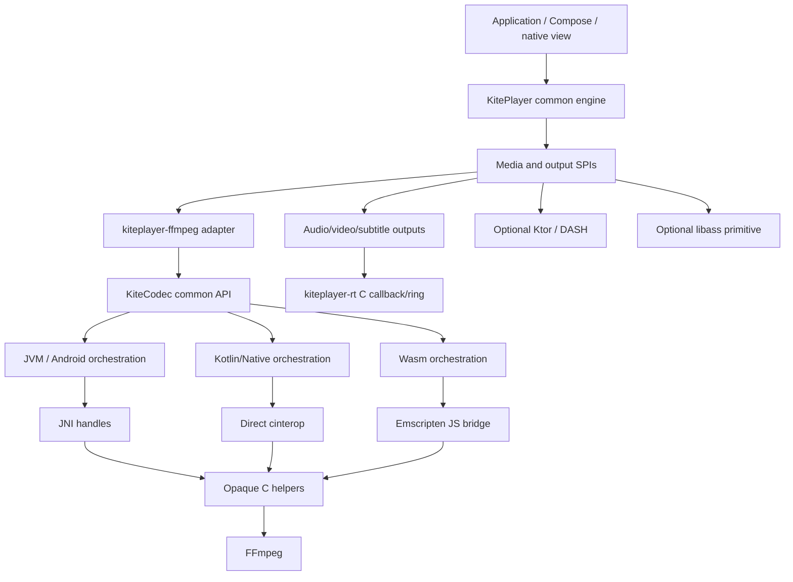
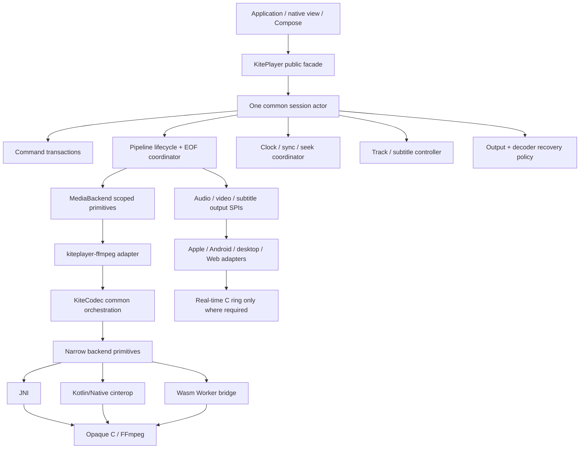

# SOLSUPREME — KiteCodec + KitePlayer code-only deep audit and supremacy roadmap

- Audit date: 2026-08-18
- KiteCodec conclusion snapshot: `f135ae286e5b054f750cb046cd9bfba00f02ddd7` (the audit began at `69c5145062ba39eb371903cdd644d851b1174a0c`)
- KitePlayer conclusion snapshot: `77ba7e63629be2d480e4a72e47affd061d521bc4` (the audit began at `6571290f15448a8b695d4227099bab6cd8ef2e5a`, plus the final visible worktree)
- Provenance: both repositories advanced concurrently during the audit, notably adding the Web RGBA/canvas path, renderer/API-dump changes, and player design-history changes; KitePlayer also retained an uncommitted `FrameLayoutTest.kt` edit at final validation. Findings and the forced Web build use the files visible at verification time. Those concurrent changes were preserved and are not attributed to the audit.
- Audited scope: both repositories' Kotlin, C, JNI/cinterop, Web interop, build logic, tests, scripts, target declarations, publication configuration, samples, and documentation
- Evidence policy: repository code is the only source of truth; no marketing claim or external documentation overrides implementation
- Dependency law: KitePlayer's shipped/default FFmpeg media path depends on KiteCodec through an SPI adapter; another backend can implement the SPI. KiteCodec never depends on KitePlayer. Findings are labeled by owner and cross-project findings by the `Gemini` seam.

## 1. Executive verdict

The two repositories do contain a real player, but the pair is not yet a uniformly installable or behaviorally equivalent cross-platform product. KiteCodec is the lower-level codec/demux/filter/mux substrate. KitePlayer is a substantial common-Kotlin playback engine above it, with an actor, worker lanes, clocks, queues, seek generations, audio DSP, render/output SPIs, subtitles, platform outputs, a small Ktor/DASH layer, and optional libass. The earlier architectural gap was not solved by making KiteCodec own playback; it was solved in the correct repository and dependency direction.

KitePlayer's strongest part is its common engine: ownership intent is unusually explicit, decoder send/drain retry is generally correct above the backend, worker quiescence and seek generations are thoughtfully designed, and the real-time C ring is exceptionally well tested. Its weakest parts are terminal-state correctness, transactional commands, output/device recovery, audio-tail flushing, a 4,800-line orchestration class, incomplete Web/default-renderer wiring, output-layout fidelity, unintegrated libass, primitive adaptive streaming, and distribution. KiteCodec's central architectural problem remains duplicated backend orchestration: lifecycle, retry, state, cancellation, validation, timestamp, and progress logic is independently handwritten in JVM, Native, and Wasm actuals and has already drifted into data loss, false EOF, leaks, UAF races, and incorrect seeking.

The immediate release decision is **block** for any claim resembling “one Kotlin player on every declared platform.” There are confirmed KiteCodec P0 defects in Wasm decoding, Native lifetime handling, C conversion validation, sink closing, and artifact delivery. At the Gemini boundary, the checked-in projects do not establish a reproducible normal-repository installation path, several published player variants have no matching remotely publishable KiteCodec variant, the final Kotlin/Native consumer needs a non-transitive codec plugin, and the Web distribution still does not carry the codec runtime. KitePlayer also has confirmed high-impact playback defects, including tail-audio loss at EOF, non-transactional track and external-subtitle changes, reuse of a closed custom `MediaIo`, and commands that report success before their promised state exists.

The target architecture should remain Kotlin-first and layered. Move KiteCodec state machines into common Kotlin; keep C for the FFmpeg ABI, real-time audio callback, and genuinely platform-native primitives; keep KitePlayer's engine backend-neutral; and generate repetitive bridge declarations, handles, target manifests, and error glue. Do not merge the repositories, move player policy into JNI, or make `kiteplayer-rt` a transitive feature of the codec library.

Classification used below:

- **P0:** release blocker—memory/process safety, silent data loss, materially false platform/capability behavior, or inability to deliver a claimed runtime.
- **P1:** high-impact correctness, lifecycle, parity, integration, or API defect that should precede broad feature work.
- **P2/design:** maintainability, performance scalability, ergonomics, hardening, or future-compatibility work with a currently usable narrower path.
- **Feature gap/roadmap:** code is absent rather than implemented incorrectly. These items are not mislabeled as bugs.

“Confirmed” means the implementation directly establishes the failure path; “risk” means the unsafe or incompatible shape exists but repository code does not prove normal supported-path reachability.

### Readiness scorecard

These scores measure readiness for the stated “supreme player” goal, not effort or promise.

| Domain | Readiness | Code-grounded verdict |
|---|---:|---|
| KiteCodec C helper design | 7/10 | Opaque ABI, compatibility gate, ownership tests, sanitizers, fuzz seeds, and explicit exports are strong. Invalid format handling, lifetime leasing, filter correctness, and ABI versioning still need work. |
| JNI bridge | 5/10 | Generation-tagged handles and dynamic registration are sound directions. Pointer leases, exception preservation, typed signature generation, packaging, and hot-path copies are incomplete. |
| Common Kotlin API | 6/10 | Ownership and timestamp contracts are unusually explicit; typed models are promising. Flow ownership, mutable snapshots, error taxonomy, output metadata, and Java/Swift ergonomics are unresolved. |
| JVM implementation | 6/10 | The most disciplined backend for object locking and demux exclusivity. Sink close races, encoder terminal-state bugs, packaging gaps, copying, and missing CI lower confidence. |
| Kotlin/Native implementation | 4/10 | Broad feature surface and direct cinterop, but raw-pointer use and check-then-use close races make concurrency unsafe; orchestration differs from JVM. |
| Wasm implementation | 2/10 | Real probe/demux/decode code exists, but send/drain, EOF, seek, ownership, options, input streaming, memory transfer, and runtime packaging are not production-safe. |
| JS implementation | 1/10 | Deliberate typed refusal; API resolution exists, media functionality does not. |
| KitePlayer common engine | 6/10 | A real common actor/clock/queue/seek/sync engine with strong ownership reasoning and broad deterministic tests. EOF, command transactions, close/cancellation, device recovery, subtitle scheduling, and monolithic complexity remain material. |
| Player outputs and rendering | 5/10 | Real CoreAudio/RemoteIO, AudioTrack, JVM audio, Metal/AppKit/UIKit, Android Surface/GPU, Compose, WebAudio, and a manual Web canvas path exist. Platform completeness, layout fidelity, subtitle/control parity, recovery, and packaging do not. |
| Player networking/adaptive media | 2/10 | Ktor range I/O and a static single-representation DASH prototype exist. Range identity, retry/reconnect, ABR, audio+video coordination, live/HLS, prefetch, and publication are absent. |
| Pair feature completeness | 5/10 | Play/pause/seek, sync, queues, tracks, external text subtitles, chapters, AB loop, rate, filters, capture, and frame-step APIs exist. Several are partial or semantically inaccurate; mature live, device, subtitle, DRM, observability, and playlist features remain. |
| Build/install/integrability | 1/10 | Selected source-tree/local-Maven paths work. The checked-in code contains no reproducible publicly consumable KitePlayer/KiteCodec matrix, no KitePlayer release workflow, mismatched variants, no ordinary release-quality Android/Apple/Web package, and no atomic pair release. |
| Tests and compatibility | 6/10 | The common engine and RT ring have unusually substantial tests. Published-target parity, real Web playback, packaged consumers, physical mobile devices, Windows, and release artifacts are not continuously gated; the ffmpeg Wasm tests do not compile. |
| Documentation truth | 3/10 | Limitations are often candid, but many comments, POM descriptions, facade KDocs, module tables, JVM/Wasm status claims, and feature-absence claims contradict current code. |

## 2. What the repository actually is

The audited product is two repositories with a one-way dependency. KiteCodec is independently useful as a media toolkit. KitePlayer supplies the player policy and uses KiteCodec through `MediaBackend`/decoder/frame adapters. This separation is correct and should be preserved.



The two main concentration problems are different:

1. KiteCodec duplicates stateful orchestration in JVM, Native, and Wasm. Demux ownership, decoder send/receive, draining, seek, encoder flush, filters, progress, error mapping, and close behavior have drifted.
2. KitePlayer centralizes policy correctly in common Kotlin, but `PlaybackCore.kt` is roughly 4,800 lines and owns session construction, commands, workers, queues, buffering, seeking, recovery, subtitles, track rebuilds, diagnostics, and teardown. It is testable, but change coupling is already high.

The module boundaries around that engine are mostly healthy: `kiteplayer-core`, `-ffmpeg`, `-output`, `-network`, `-subtitles`, `-libass`, `-view`, `-mobile`, `-compose-interop`, `-compose-video`, and `-rt` separate responsibilities. The compatibility umbrella modules and the many stale comments add noise, but the core dependency direction does not need reinvention.

The desired Kotlin/native balance is therefore specific:

- common Kotlin owns playback state, validation, selection, retry, timestamp, cancellation, and capability negotiation;
- KiteCodec platform actuals expose narrow, scoped, memory-safe primitives;
- C owns the stable FFmpeg ABI and real-time callback code where Kotlin allocation/scheduling is inappropriate;
- JNI remains for JVM/Android native access, but repetitive declarations and handles come from one schema;
- platform render/audio APIs remain behind output SPIs rather than entering the codec library.

## 3. Existing strengths to preserve

This audit is intentionally severe, but the code contains foundations worth keeping.

1. **The C surface is deliberately opaque.** `native/kitecodec-c/include/kitecodec_handles.h` avoids exposing FFmpeg structs, and the helper declarations in `kitecodec_helpers.h` are export-controlled. This is substantially safer than letting Kotlin or Java depend on FFmpeg layouts.
2. **The FFmpeg identity gate is unusually thoughtful.** `native/kitecodec-c/src/kitecodec_abi.c:267-309` freezes header versions, compares runtime versions/configurations, uses `pthread_once`, provides a diagnostic-only bypass, and tests doctored header/runtime combinations.
3. **Ownership intent is explicit.** `Playback.kt:98-156`, `Frame.kt:3-18`, and C header contracts spell out packet-consumption and frame-lifetime rules. Those contracts made several parity defects objectively provable.
4. **The JVM backend has a good lifetime pattern.** `Frame.jvm.kt:10-24`, `Playback.jvm.kt:8-17`, and source cursor state in `MediaSource.jvm.kt:20-49` hold locks across the full native operation. That should become the semantic reference, then move to common code.
5. **Host C verification is real.** The seven C suites cover ownership, buffers, rational rescaling, threaded error storage, conversion, identity, and argument validation. Plain, ASan/UBSan, TSan, and allocation-interposition modes exist.
6. **The repository has compatibility ratchets.** API dumps, C declaration/signature baselines, symbol audits, deleted-surface checks, and cinterop coupling checks are useful infrastructure.
7. **Typed media metadata already exists.** Time bases, color declarations, sample aspect ratio, rotation, dispositions, chapters, channel masks, and stream metadata are represented. The main gap is preserving and propagating them.
8. **Target floors are centralized.** `CompileKiteCodecCTask.kt:365-395` encodes minimum macOS/iOS/glibc versions rather than scattering them through every link task.
9. **Prebuilt fetching has positive controls.** HTTPS enforcement and per-target SHA-256 expectations exist, even though the cache and redirect logic weaken them.
10. **The lean FFmpeg profile is explicit.** Allowlisting protocols/codecs/components is a good security and size baseline. The profile needs a truthful capability manifest and a broader streaming tier, not abandonment.
11. **KitePlayer's engine is genuinely common Kotlin.** `PlaybackCore`, the clock and sync law, packet queues, buffering, seek machine, audio pipeline, subtitle cue selection, and most state transitions do not fork per platform. This is the architectural direction KiteCodec should copy for orchestration.
12. **Worker ownership is unusually deliberate.** `PlaybackWorkers.kt:69-176` defines quiescence handshakes, bounded polling, release epochs, and abandonment cleanup instead of treating coroutine cancellation as a native-resource destructor.
13. **Decoder fallback is designed rather than improvised.** The KiteCodec adapter retains a bounded compressed-packet window, tracks hardware confirmation, replays into software, preserves generations, and tests first-send and post-output failures.
14. **The real-time C audio core is excellent.** `kiteplayer-rt/native/src/kite_rt_ring.c`, `kite_rt_render.c`, and `kite_rt_ring_internal.h` use one checked allocation, atomic shared fields, bounded callback work, no callback allocation/locks, and timestamp segments; fail-closed teardown is in `kite_rt_coreaudio.c:529-573`. Eight C suites cover arithmetic, wrap, silence, bounded work, concurrency, allocation, callback, and timebase behavior.
15. **Hardware frame ownership has strong local designs.** Android MediaCodec frames use one-shot atomic release and versioned Surface fencing; Android GPU images use bounded generation leases; Metal retains CVPixelBuffers and releases textures from command completion.
16. **Platform absence is usually explicit.** Unsupported targets tend to return an unavailable capability or refusal rather than pretending to have a device. The remaining problem is that “API compiles,” “backend decodes,” “output exists,” and “product plays” are still conflated in target descriptions.
17. **Module separation is good.** The player engine does not import FFmpeg, the RT callback is not buried in KiteCodec, optional Ktor/libass do not bloat the default engine, and native-view versus Compose rendering are separate choices.
18. **KitePlayer also uses compatibility ratchets.** Most public modules enable `explicitApi()` and ABI validation, build logic checks publication sibling edges and RT coupling, and platform tests include deterministic simulation, differential ring tests, real-thread stress, color instrumentation, and device-oriented seams.

## 4. Platform truth matrix

“Registered,” “compiles,” “runs,” “is packaged,” and “is behaviorally equivalent” are separate properties. They must never again be summarized as one “supported” flag.

### KiteCodec substrate matrix

| Target | Declared tier | Backend in code | Current functional surface | Runtime/package truth | Repository/audit evidence | Verdict |
|---|---|---|---|---|---|---|
| macOS arm64 K/N | Stable | Direct cinterop | Probe, demux, decode, filter, encode, mux, remux, transcode | System FFmpeg works locally; vendored path exists | System and vendored native tests/E2E | Best-supported target, but Native lifetime races remain |
| Linux x64 K/N | Stable | Direct cinterop | Same public surface, reduced vendored codec/filter profile | System path tested; checked-in pipeline does not demonstrate the promised prebuilt set | apt tests/E2E; no prebuilt-artifact consumer | Functional source target, not proven release artifact |
| Android Native arm64/arm32/x64 | Stable | Direct cinterop | Full K/N API; MediaCodec compiled into profile | Vendored LGPL; JavaVM handoff absent in nativeMain | Compile only | API/compiler tier, not runtime-qualified MediaCodec tier |
| macOS x64 K/N | Experimental | Direct cinterop | Full native API | Requires local tree | No CI | Unqualified |
| iOS arm64/simulator/x64 | Experimental/local | Direct cinterop | Full native API with platform profile constraints | No XCFramework or SwiftPM distribution | No CI/device suite | Unqualified and hard to integrate |
| Linux arm64 K/N | Experimental | Direct cinterop | Full API, reduced profile | Requires local tree | No CI | Unqualified |
| Windows x64 K/N | Experimental | Direct cinterop | Full API, reduced local producer | CI consumes unrelated prebuilt shared FFmpeg rather than producer output | Some runtime CI, no release consumer | Does not prove shipped profile |
| JVM | Always in publication | JNI | Broad full API | Resource staging is effectively macOS arm64 only; optional Linux nested under that host; no Windows/mac-x64 producer | Local-audit `jvmTest` passed; no checked-in JVM CI job | API publication can resolve but runtime delivery is nondeterministic |
| Regular Android KMP/AAR | Hidden local scope | JNI | Broad full API | Enabled only by `kitecodec.phoneTargetsOnly`; arm64/x64 JNI only; host-coupled NDK setup | No AAR/device CI | Not a normal consumable Android library |
| JS browser/node | Always in publication | Typed refusal | Capability diagnostics; media operations fail | No codec runtime | Local-audit Node refusal tests only; no checked-in CI job | Placeholder, not a player target |
| WasmJs browser/node | Always in publication | JS-loaded Emscripten module | Probe, demux, packet read, partial decode/seek/frame access | Required `.mjs`/`.wasm` is not attached to publication | Local-audit compilation/common tests only; no codec behavior or checked-in CI suite | Real but unsafe and incomplete backend |

### KitePlayer playable-product matrix

This second matrix is deliberately stricter. A player target needs the common engine, a resolvable codec backend, an audio clock/device policy, video presentation where claimed, packaging, and execution evidence.

| Target | Engine/API | KiteCodec backend | Output/presentation | Distribution and evidence | Product verdict |
|---|---|---|---|---|---|
| macOS arm64 K/N | Full common engine | Real direct cinterop | CoreAudio, AppKit/Metal, subtitle rasterizer, sample | Strongest local path; manual/local dependencies; no KitePlayer release workflow | Experimental full-player candidate, not public-supported |
| iOS arm64/simulator | Full | Real only through local/private codec variants | RemoteIO, UIKit/Metal, view and Compose paths | Private static sample framework; no XCFramework/SwiftPM/CocoaPods or physical-device gate | Local simulator/device-link candidate |
| Ordinary Android | Full | Real JNI only through KiteCodec's local phone scope | AudioTrack, Surface/Canvas/GPU, native View, Compose | Local-only codec AAR; arm64/x64 sample; no public AAR/device release gate | Experimental emulator path, not installable product |
| JVM macOS arm64 | Full | Real JNI | `javax.sound.sampled`, AWT subtitle rasterizer, software Compose video | JVM tests pass locally; codec native resource is host-specific; no public KitePlayer release | Real local desktop path |
| JVM Linux | Full | Code path exists | Desktop audio and software rendering code | KiteCodec Linux JNI bundling is opt-in; only manual scripts | Unqualified |
| JVM Windows | Full | Loader path exists, matching packaged native not demonstrated | Desktop code | No matching producer, packaging, or checked-in run | Unqualified |
| Linux x64 K/N | Full | Real | No device audio sink or UI renderer in `kiteplayer-output` | Manual container decode tests only | Decode engine, not a player product |
| Linux arm64 K/N | Full | Real locally | No sink/UI | Matching remotely publishable codec variant absent | Local decode candidate |
| Windows MinGW x64 | Full | Link-local | No sink/UI | Link-only and matching remote codec variant absent | Not runnable player |
| Wasm browser | Full single-thread engine | Real only after external module attachment | WebAudio; manual `WebCanvasVideoRenderer` exists in the final visible worktree; default output still supplies no renderer/rasterizer | Browser distribution omits `kite.mjs` and fixture; no open/play E2E; ffmpeg Wasm tests do not compile | Emerging manual browser path, not a self-contained Web player |
| Wasm Node | Full | Real if external module attached | Silent paced sink, no meaningful video surface | API/test host only | Useful conformance environment, not playback product |
| JS | Full API surface | Explicit unavailable placeholder | Placeholder | No codec runtime | Compile-only compatibility target |
| tvOS/watchOS/iOS x64/Android Native | Core/subtitle/RT declarations only in varying combinations | No assembled KitePlayer backend | RT device glue refuses most of these | No complete stack | Target declaration, not player support |
| macOS x64 | Not declared by KitePlayer | — | — | — | Missing target |

The final visible Web canvas additions improve capability but do not make the checked-in sample/package self-contained: `KitePlayerPlatform.createOrNull()` constructs `WebOutputBackend` without a canvas (`KitePlayerPlatform.wasmJs.kt:51-55`), `WebOutputBackend.videoRenderer` and `subtitleRasterizer` remain null (`WebOutputBackend.kt:36-42`), and `kiteplayer-compose-video` has no Wasm target. A consumer must explicitly call `WebCanvasRendererFactory(canvas).create()`, then `attachRenderer(renderer)` before opening media (`KitePlayer.kt:504-506`); there is no default facade parameter that wires it.

Missing **full-stack** target families include tvOS and watchOS (core/RT declarations are not a playable stack), visionOS, Mac Catalyst, macOS x64, Windows ARM64, Android x86 for the regular AAR, additional Linux architectures, and a deliberate WASI story. Adding target declarations before artifact and behavior gates exist would increase debt rather than parity.

## 5. Feature parity matrix

### KiteCodec capabilities

| Capability | JVM/JNI | Kotlin/Native | WasmJs | JS | Important caveat |
|---|---:|---:|---:|---:|---|
| Runtime identity/capability probe | Yes | Yes | Partial | Diagnostic only | Wasm errors and report packaging differ |
| Path/URL open | Yes | Yes | No; caller-supplied bytes only | Refused | JVM/Native are blocking and have no interrupt callback |
| Custom byte input | Yes | Yes | Whole-file staging | Refused | Ownership leaks on failure; no async Web source |
| Demux/packet reader | Yes | Yes | Partial | Refused | One cursor requires strict exclusivity |
| Seek | Yes | Yes | Incorrect in edge cases | Refused | Wasm start-time/window semantics broken |
| Software decode | Yes | Yes | Partial | Refused | Wasm send/drain can lose frames |
| Exact decoder/options/thread policy | Yes-ish | Yes-ish | Silently ignored | Refused | Error taxonomy and validation still drift |
| Hardware decode | Platform-specific | Mostly VideoToolbox/MediaCodec profile claims | Refused/ignored | Refused | No general device enumeration/fallback contract |
| Frame byte copy | Yes | Yes | Catastrophically chatty interop | Refused | No common zero-copy lease |
| Frame construction/image encoding | Yes | Yes | Refused | Refused | JVM performs avoidable extra copies |
| Filter graph | Yes | Yes | Refused | Refused | Multi-input scheduler API is inadequate |
| Encode/mux | Yes | Yes | Refused | Refused | Sink state and metadata propagation defects |
| Remux/transcode | Yes | Yes | Refused | Refused | Subtitle-only/progress/semantic preservation defects |
| Custom output sink | No | No | No | No | Path-only mux integration limits embedding |
| Subtitle decode/render | No | No | No | No | `subtitleCopy` is not subtitle playback |
| Player session/clock/output | No | No | No | No | Must be a separate common engine layer |

### KitePlayer + KiteCodec product capabilities

| Capability | Exists | Quality/parity verdict |
|---|---:|---|
| Common player state and commands | Yes | Real actor/state flow with open/play/pause/stop/seek/rate/volume/mute/delay/AB loop. Some commands are fire-and-forget or report success before transactional completion. |
| A/V clock and sync | Yes | Audio-mastered common clock, drift/drop scheduling, latency model, and simulation tests. Device-change recovery and renderer-vsync updates are not implemented. |
| Queue/playlist | Partial | Queue navigation and repeat exist; gapless preopen/crossfade, durable playlist model, per-item resume, and remote/adaptive playlist semantics do not. |
| Track selection | Partial | Audio/video/container-subtitle selection rebuilds the entire source and requires reopen/seek; external-to-external text subtitle changes can swap cue tables in place. Requests can report superseded work as success, and the default selector is weak. |
| Text subtitles | Partial | Embedded/external SubRip, WebVTT, and simplified ASS text paths exist with rasterizers on several targets. Custom I/O/URL external subtitles, persistent libass, bitmap subtitles, rich styling, and viewport-correct layout are incomplete. |
| Full ASS/libass | Standalone primitive | Android/Native snapshot renderers exist but are unpublished, have unspecified concurrency and an unsafe concurrent-close shape, are reparsed per render, are Unicode-divergent, and are not wired into playback. |
| Chapters | Yes, flawed | Models and events exist; chapter lookup ignores explicit end times and can report a chapter in a gap. Programs/editions are exported always-throwing stubs. |
| Frame step/capture | Partial | APIs exist, but “step” is a nominal-frame-duration precise seek rather than next decoded frame and is not VFR/B-frame accurate. Capture cancellation can stop the player. |
| Filters | Partial | Raw KiteCodec/FFmpeg graph strings attach to media; no typed player overload/capability validation; diagnostics claim none; changing frame format and FPS-changing filters are mishandled. |
| Playback speed | Yes, quality gap | Pitch-changing and preserve-pitch paths exist. Linear resampling is low quality, WSOLA has no EOS flush, and multichannel downmix lacks headroom. |
| Hardware decode/render | Partial | VideoToolbox/MediaCodec and several zero-copy render paths exist. Policy, color/control parity, fallback evidence, device enumeration, and target breadth are incomplete. |
| Network HTTP/HTTPS | Optional source module | Ktor streaming/range works through blocking JVM/Native bridges. On Wasm it is incompatible with the current synchronous AVIO adapter. The module is unpublished; Content-Range identity, timeouts, retry/reconnect, validators, metrics, proxy/auth policy, and live resilience are absent. |
| DASH | Prototype | Static, one period, one highest-bandwidth representation, serial whole-segment fetch, no separate audio merge, no ABR/live/seek/DRM. This is not adaptive playback yet. |
| Web playback | Emerging | Wasm engine, codec adapter, WebAudio, and a manual canvas renderer exist in the final worktree. Runtime/package/default renderer wiring and real browser open/play tests remain absent; hot paths still cross JS per sample/overlay byte. |
| Diagnostics/events | Partial | State, events, warnings, stats, history, and support bundle exist. Event delivery is lossy, backend warnings bypass history, support data can leak option secrets, and some diagnostics are false/stale. |
| Java/Swift ergonomics | Weak | Kotlin Flow/value-class/AutoCloseable surfaces dominate; no deliberate Java callback/Publisher facade or Swift AsyncSequence/scoped-frame package. |

## 6. P0 — release-blocking correctness and safety defects

### P0-01 — Wasm drops packets when the decoder says “not consumed”

- Evidence: `kitecodec-core/src/wasmJsMain/kotlin/io/github/yuroyami/kitecodec/MediaSource.wasmJs.kt:94-118`; contract in `kitecodec-core/src/commonMain/kotlin/io/github/yuroyami/kitecodec/Playback.kt:122-156`.
- Failure: `StreamDecoder.send()` returning false/EAGAIN means the packet was not consumed. The batch decode loop closes/drops that packet instead of draining output and retrying the same packet. Buffered and B-frame codecs can lose frames.
- Required correction: implement the JVM/Native `send -> drain -> retry same input` loop once in common Kotlin. EOF must continue receiving until actual codec EOF, not until the first temporary empty result.
- Acceptance: a bounded-queue fake backend proves every input is retried unchanged; B-frame fixtures produce identical frame counts and terminal PTS on JVM, Native, and Wasm.

### P0-02 — Wasm confuses closed packets, drain submission, and actual EOF

- Evidence: `Playback.wasmJs.kt:146-185`.
- Failure: `packet?.pointer ?: 0` turns a closed packet into a null/EOF packet. `isDrained` becomes true when null is submitted, even if submission returns EAGAIN, while receive does not transition on real `AVERROR_EOF`. Callers can truncate buffered tail frames or accidentally drain by sending a closed packet.
- Required correction: validate packet liveness and stream ownership, model `Open -> Draining -> Drained -> Closed`, and derive transitions only from native return codes.
- Acceptance: closed/wrong-stream packets are typed failures; EAGAIN cannot mark drained; EOF is reached only after receive reports EOF.

### P0-03 — Wasm silently ignores requested decoder policy

- Evidence: `MediaSource.wasmJs.kt:153-183`; common contract `MediaSource.kt:112-131`.
- Failure: `threadCount`, exact `decoder`, arbitrary `DecoderOptions`, and `hardware` are accepted but ignored; only low-delay is applied. A caller can request a particular software/hardware/security policy and run something else without warning.
- Required correction: implement each option or reject every unsupported non-default value before allocation. Silent degradation is not acceptable.
- Acceptance: a per-target capability test enumerates every parameter and proves applied-or-refused behavior.

### P0-04 — Wasm seeking and frame extraction violate the public timeline contract

- Evidence: `Playback.wasmJs.kt:122-133`; `MediaSource.wasmJs.kt:121-143`; common timeline KDoc in `MediaSource.kt:20-91`.
- Failure: content-relative microseconds are sent directly to FFmpeg without adding `startTimeMicros`; backward bounds are incorrect; reader-open state is not validated; `extractFrame` seeks exactly to the target and returns the first frame without decoding forward to the requested PTS. Nonzero-start and keyframe-based formats return the wrong position/frame.
- Required correction: centralize content/container timestamp conversion and seek windows in common Kotlin; seek to a safe earlier point and discard until target PTS.
- Acceptance: MPEG-TS/nonzero-start, sparse-keyframe, backward/forward/precise, target-before-start, and target-after-end fixtures match across backends.

### P0-05 — Wasm source/decoder ownership leaks and permits cursor races

- Evidence: `MediaSource.wasmJs.kt:94-118,145-151,186-195`; `Playback.wasmJs.kt:188-195`.
- Failure: multiple readers/decode flows can mutate one format cursor. Independently allocated codec contexts are not freed if the source was closed first because the code incorrectly assumes format teardown owns them. Partial multi-decoder creation leaks earlier contexts when a later open fails.
- Required correction: one source-owned cursor lease, independently owned child decoder handles, staged construction, and unconditional child cleanup independent of parent state.
- Acceptance: fail every allocation/open step under fault injection; live-handle count returns to zero; concurrent cursor acquisition is rejected deterministically.

### P0-06 — Web custom I/O blocks, violates source semantics, leaks, and crosses JS once per byte

- Evidence: `WebIoBridge.kt:6-17,32-104`; ownership contract `MediaByteSource.kt:14-34`; `WebMemory.kt:57-69`.
- Failure: non-suspend `MediaSource.open` synchronously stages an entire known-size input up to 512 MiB, calls seek even on nonseekable sources, never closes the owned source, and copies with Kotlin-to-JS calls per byte. A 1080p YUV frame can require roughly three million boundary calls; a large browser input can freeze the UI.
- Required correction: a Web-specific asynchronous/range source or Worker-backed ring buffer, bulk `HEAPU8.set/subarray`, and exactly-once source closure. Keep a small explicit in-memory source as a separate convenience API.
- Acceptance for the current in-memory scope: seekable and nonseekable inputs obey their contract, source closure is exactly once, and all transfers are bulk rather than per-byte. Progressive network input, unknown size, and media beyond the documented 512 MiB ceiling belong to the subsequent streaming-source feature, not this defect’s minimum fix.

### P0-07 — Unconfined Kotlin/Native object lifetimes contain check-then-use races; confined objects lack defensive parity

- Evidence: `Frame.native.kt:78-99,315-322`; `Playback.native.kt:149-169,348-418`; `FilterGraph.native.kt:45-93,233-241`; seek and codec-parameter paths in `MediaSource.native.kt:354-402`.
- Failure: unconfined Frame, FilterGraph, and sink operations separate atomic/plain closed checks from raw-pointer FFI use and free, so concurrent close can produce UAF. `MediaSource` and `PacketReader` explicitly require coroutine-context confinement/serialized operations (`MediaSource.kt:5-9`; `Playback.kt:60-64,191-201`); their check-then-use shape is therefore a defensive-parity limitation under the current contract rather than a supported-use concurrency guarantee. The JVM backend nevertheless holds locks for full operations.
- Required correction: a reusable operation lease/mutex abstraction for unconfined Native handles, plus runtime confinement enforcement or the same defensive lifetime behavior for source/reader objects.
- Acceptance: close-vs-read/send/seek/filter/encode/copy tests under TSan and stress loops produce neither crash nor stale access.

### P0-08 — Native filter/encoder paths bypass their own checked frame accessor

- Evidence: mandatory accessor documented in `Frame.native.kt:90-99`; direct `frame.nativeFrame` use in `FilterGraph.native.kt:72-83,207-216` and `MediaSink.native.kt:403-420,485-510`.
- Failure: already-closed or concurrently closed frames pass freed `AVFrame*` into FFmpeg. Media type is also not consistently validated before passing a frame to audio/video graph or encoder operations.
- Required correction: accept a scoped frame lease, validate video/audio compatibility, and never expose/use a naked pointer outside that scope.
- Acceptance: closed frame, wrong-media frame, and concurrent frame-close inputs always fail before FFI.

### P0-09 — C pixel conversion accepts a process-aborting format, and its test calls the crash success

- Evidence: `native/kitecodec-c/src/helpers_frame.c:90-98`; JNI input `native/kitecodec-jni/kj_frame.c:122-135`; `native/kitecodec-c/tests/test_convert.c:531-603`, especially `:583-592`.
- Failure: an arbitrary integer reaches swscale without pixel-format validation. The audited ASan/plain runs observed child signal 6, while the test explicitly accepts `SIGABRT`, `SIGSEGV`, or `SIGBUS` as a passing outcome. This is directly reachable through the exported C helper and an internal JNI integer entry; normal typed Kotlin conversion paths select known formats and do not expose an arbitrary integer, so supported Kotlin reachability is narrower than the C ABI defect.
- Required correction: validate source/destination descriptors, reject unknown/`NONE`/hardware-only formats, return an error code plus output pointer, and make every signal a hard failure.
- Acceptance: every integer around enum boundaries and all hardware formats return a typed error without signal under ASan/UBSan.

This is P0 for any shipped artifact that treats `kitecodec_helpers.h` as a supported/exported C boundary. If the helper surface is made private and all typed bridge callers prove enum validation before it, its release severity can be narrowed to internal P1 hardening; the signal-accepting test is wrong either way.

### P0-10 — JVM sink closing is not an atomic state transition

- Evidence: `MediaSink.jvm.kt:197-245`; related Native paths `MediaSink.native.kt:114-201,285-333,374-681`.
- Failure: close snapshots and clears encoders under the mux lock, releases the lock while flushing, and leaves a live format token. A second close can write the trailer/free the muxer while the first is encoding; a concurrent add can append a core after the snapshot and leak it. Native also allows encode/close races.
- Required correction: explicit `Open -> Closing -> Closed/Failed`, one atomic closer, serialized encoder flush/trailer/I/O close, and rejection of add/encode in Closing.
- Acceptance: concurrent close/encode/add stress has one trailer, no leaked encoder, no native access after free, and deterministic suppressed errors.

### P0-11 — The checked-in release pipeline declares itself unable to produce its prerequisite assets

- Evidence: blocker recorded in `.github/workflows/release-binaries.yml:25-29`; publish dependency at `:182-185`; asset requirements in `.github/workflows/publish.yml:10-13,85-102`; candid status in `README.md:141-153`.
- Failure: the workflow itself records that its macOS self-contained arm cannot pass with the configured dependencies; the release job requires macOS, Linux, and Android together, and Maven publication requires that asset set. Code inspection proves the checked-in pipeline is blocked as written. It does not independently prove the live state of Homebrew formulas, GitHub releases, or Maven services.
- Required correction: define a reproducible static dependency build or a slimmer release profile, create all assets, install-test them as consumers, then publish atomically.
- Acceptance: clean macOS/Linux/Windows/Android consumers resolve only public coordinates/assets and run probe + decode + encode without repository-local paths.

### P0-12 — One-dependency JVM distribution is built for fewer platforms than the loader can resolve

- Evidence: loader `JniLibrary.jvm.kt:7-16,27-87`; resource staging `kitecodec-core/build.gradle.kts:1126-1275`.
- Failure: the loader deliberately allows an explicit `kitecodec.jni.path` or `java.library.path`, then resource fallback. Its mappings cover macOS/Linux/Windows and x64/arm64, but the advertised one-dependency resource path is produced effectively only under an arm64-Mac/vendored-tree condition. Linux is optional and nested there; there is no macOS x64 or Windows producer/install artifact. Unknown OS/CPU values also fall back to Linux/x64 instead of refusing.
- Required correction: explicit supported mapping with no fallback, OS/arch-specific runtime variants/classifiers, builds on matching runners, and artifact-content tests.
- Acceptance: each advertised JVM platform has a classifier/runtime artifact, checksum, license payload, and consumer smoke; unknown platforms fail before extraction with a precise message.

### P0-13 — Wasm publication omits the module required by the Kotlin API

- Evidence: build tasks `kitecodec-core/build.gradle.kts:668-718`; loader default in `KiteCodecWeb.kt:7-67`; demo/probe-only emcc links in `scripts/wasm-browser-demo.sh` and `scripts/wasm-matrix-probe.sh`.
- Failure: Gradle builds archives and bindings but no publication/resource task emits and attaches the final `.mjs` and `.wasm`. The Kotlin target can compile and its Node tests can pass without the media runtime consumers need.
- Required correction: publish a versioned runtime package containing JS loader, Wasm binary, worker variants, capability/build manifest, and bundler metadata.
- Acceptance: npm/Gradle consumers in Node and two browser bundlers load the packaged runtime without relative repository files and decode a fixture.

### P0-14 — Portable Linux/Windows GPL build tasks are functionally LGPL; Linux release packaging would mislabel them

- Evidence: portable build branch `BuildFFmpegTask.kt:229-247`; tests `BuildFFmpegTaskTest.kt:232-266`; GPL task promise `kitecodec-core/build.gradle.kts:749-775`; public enum `FFmpegLicense.kt:7-15`; release packaging `.github/workflows/release-binaries.yml:138-176`.
- Failure: portable Linux/Windows producer tasks do not add `--enable-gpl` or desktop GPL arguments, yet task/docs contracts promise x264/x265. The checked-in release workflow packages the Linux GPL product under that false contract; it has no equivalent Windows release asset. Capability and legal labels do not describe the produced library.
- Required correction: either reject GPL for those targets or produce and verify an actual GPL profile. Artifact name, license, capabilities, link flags, and SBOM must derive from configure evidence.
- Acceptance: packaged manifest and runtime probe agree on GPL status and `libx264`/`libx265`; mismatch fails packaging.

### P0-15 — Ordinary Android is not independently buildable or publishable

- Evidence: hidden target activation `kitecodec-core/build.gradle.kts:37-44,236-257`; coupled selector `:198-203,268-279,346-366`; ABI recipes `LinkKiteCodecJniTask.kt:301-335`; NDK resolution `kitecodec-core/build.gradle.kts:926-945`.
- Failure: the AAR exists only in a local phone-superset scope requiring arm64 macOS and Apple targets. JNI recipes omit arm32 while Native claims it; NDK fallback contains a developer path and a hardcoded `darwin-x86_64` host tag.
- Required correction: a conventional Android module/target, AGP-provided SDK/NDK paths, pinned `ndkVersion`, Linux-capable builds, and a declared ABI set.
- Acceptance: `assembleRelease` and publication run on Linux from a clean clone; emulator/device tests cover every packaged ABI.

### P0-16 — Release artifacts do not yet carry a complete corresponding-source/provenance payload

- Evidence: patches applied in `BuildFFmpegTask.kt:166-211`; untouched upstream tarball and TODO in `.github/workflows/release-binaries.yml:198-209`; static dependency bundling in `.github/scripts/package-ffmpeg.sh:137-150`; JNI bundle contents `BundleHostJniTask.kt:16-29,56-111`; Apache-only POM `kitecodec-core/build.gradle.kts:793-803`.
- Failure: patched FFmpeg and numerous static dependencies can be shipped while only upstream FFmpeg source or a small manifest/license subset is attached. The JVM jar can embed the same stack without a corresponding provenance/license package. This is a technical release-compliance blocker; it is not legal advice.
- Required correction: exact post-patch FFmpeg sources or reproducible patch set, license notices and source for each dependency where its license requires source delivery, a complete provenance/SBOM record for all dependencies, build scripts/configure manifest, relink information where applicable, and artifact-to-source hashes.
- Acceptance: an automated audit maps every linked archive/shared object to a license, source digest, build recipe, provenance record, and required delivered-source artifact. This is both a reproducibility policy and a mechanism for satisfying license-specific obligations; it is not a claim that every permissive dependency universally requires source shipment.

### P0-17 — Stable Android Native advertises a MediaCodec profile without the mandatory JavaVM handoff

- Evidence: MediaCodec build contract `BuildFFmpegTask.kt:734-767`; C attachment `native/kitecodec-c/src/kitecodec_abi.c:343-362`; JVM/regular-Android attachment through `Internals.jvm.kt:225-274`; compile-only Android Native CI `.github/workflows/ci.yml:400-438`.
- Failure: the FFmpeg profile enables JNI/MediaCodec and states `av_jni_set_java_vm` is required, but no `nativeMain` path calls `kc_jvm_attach`. Software codecs may work while the advertised MediaCodec route is not operationally integrated.
- Required correction: implement and device-test a supported K/N JavaVM handoff, or disable MediaCodec and remove that capability from Android Native until it exists.
- Acceptance: each stable Android Native ABI opens and decodes H.264/HEVC through MediaCodec on device, with a capability probe proving VM attachment; otherwise the capability is absent and software/fallback behavior is explicit.

### P0-18 — The checked-in Gemini pair has no reproducible public installation path

- Evidence: KitePlayer `settings.gradle.kts:3-28` resolves the codec plugin and library from `mavenLocal()` before remote repositories; KitePlayer `README.md:404-405` says it is not publicly published; KitePlayer has no checked-in `.github/workflows`; shared publication setup at `build.gradle.kts:64-104` configures POM shape but no remote repository/signing/release orchestration.
- Failure: from the checked-in mechanisms alone, a clean consumer has no demonstrated path to obtain the pair from normal repositories. A stale local artifact with the same `0.0.9` version can shadow any other build. `checkPublicationReadiness` passed 11 modules/116 POMs/22 sibling edges because it checks metadata shape, not whether anything can be installed or run. This is a statement about repository evidence, not a live query of external repositories.
- Required correction: atomic, version-aligned KiteCodec and KitePlayer releases; remote repository/signing/developer metadata; no unconditional `mavenLocal()`; isolated consumer builds that resolve from the staged release repository only.
- Acceptance: empty Gradle/Maven caches on each target install the pair without sibling checkouts, local paths, or preseeded native artifacts and run an open/play/seek/close smoke.

### P0-19 — KitePlayer publishes backend variants that its required KiteCodec release model cannot supply

- Evidence: KitePlayer backend targets and dependency `kiteplayer-ffmpeg/build.gradle.kts:68-106`; KiteCodec publication scopes `kitecodec-core/build.gradle.kts:79-106,150-160,236-257,294-313`; final-link warning `KitePlayer/kiteplayer-sample/build.gradle.kts:5-10`.
- Failure: ordinary Android, iOS, Linux arm64, and MinGW KitePlayer variants depend on matching KiteCodec variants that the checked-in remote-publication model refuses or classifies as local/experimental. Android Native is not an ordinary Android AAR substitute. Kotlin/Native applications also need the KiteCodec Gradle plugin at the final link, but applying it inside a dependency is not transitive.
- Required correction: publish one matching target matrix atomically or stop publishing unmatched player variants. Provide a player application plugin/convention that configures the codec source/license/link requirements once, while encoding link metadata in variants wherever Gradle permits.
- Acceptance: Gradle metadata resolution tests for every player target prove exactly one matching codec variant and a final link without undocumented consumer build logic.

### P0-20 — KitePlayer can declare Ended before all decoded audio is rendered

- Evidence: KitePlayer `PlaybackCore.kt:2627-2708` decides terminal drain from decoder/packet state and `audio.buffered`; the capacity-four decoded-audio handoff is created at `:4403-4404`, produced at `:4234-4240`, and consumed at `:4267-4300`; preserve-pitch stages `AudioPipeline.kt:193-202`, `TempoStage.kt:114-181`, and `AudioPlayback.kt:428-443` expose no EOS flush.
- Failure: the packet queue/decoder can be drained while decoded buffers still wait for the feeder. If the device ring is momentarily empty, the sink is drained and the player reaches Ended before those buffers are fed. At non-1x preserve-pitch speed, WSOLA retains a short tail and reset discards it. This is silent media loss, especially visible on short files and slow conversion.
- Required correction: explicit EOS tokens and joins through decoder-to-feeder-to-DSP-to-sink; `finish()` on every buffering DSP stage; terminal state gated on all handoffs/stages being drained.
- Acceptance: adversarial capacity-one/slow-feeder tests and short audio fixtures at every supported speed produce the full expected sample count before Ended.

## 7. P1 — high-impact correctness, parity, and API defects

### Decoder, packet, timeline, and source lifecycle

| ID | Finding | Evidence | Impact and correction |
|---|---|---|---|
| P1-01 | JVM, Native, and Wasm custom-source early-open failures can omit `MediaByteSource.close()` | JVM `MediaSource.jvm.kt:437-450`; Native `MediaSource.native.kt:732-780`; Wasm `WebIoBridge.kt` | JVM does clean up after a context has opened and later assembly fails, but an exception from the initial `fmtOpenInputIo` precedes that scope. Native disposes its `StableRef` on early failure without closing the source; Wasm also violates ownership. Wrap from adapter/StableRef creation onward, preserve callback cause, and close exactly once on all paths. |
| P1-02 | Native source assembly leaks after successful probe if later Kotlin construction throws | `MediaSource.native.kt:650-677` | `buildStreams`, metadata, chapters, or constructor failures strand format/custom-I/O state. Stage the whole assembly in one cleanup scope. |
| P1-03 | Wrong-stream packets are accepted by decoders | `Playback.jvm.kt:141-151`; `Playback.native.kt:348-361`; `Playback.wasmJs.kt:153-166` | INVALIDDATA is often swallowed as consumed, silently dropping input. Verify stream/source identity before FFI; prefer source-scoped opaque packet handles. |
| P1-04 | Exact decoder/encoder/filter absence maps to `Internal` rather than typed not-found errors | `Playback.jvm.kt:211-224`; `Playback.native.kt:431-448`; `MediaSink.jvm.kt:124-145`; `MediaSink.native.kt:218-221`; `FilterDsl.kt:233-243` | Documented catch/fallback by error kind cannot work. Centralize semantic error factories with native code, operation, and cause. |
| P1-05 | JVM/Native decoding unconditionally swallows `AVERROR_INVALIDDATA` | Batch paths `MediaSource.jvm.kt:155-180`, `MediaSource.native.kt:302-337`; manual decoder paths `Playback.jvm.kt:148-165`, `Playback.native.kt:352-383` | Corruption becomes invisible even under strict decoder options. Wasm instead maps it to `Internal`, another parity difference. Add strict/tolerant policy plus counters/events. |
| P1-06 | Open option reporting is wrong on Wasm | `MediaSource.wasmJs.kt:220-223,325-349`; `native/kitecodec-c/src/helpers_format.c:216-290` | The binding treats the input keys as an output list instead of reading FFmpeg’s unused dictionary, so every option can be reported unused. Expose the actual unused dictionary through the C ABI. |
| P1-07 | Blocking FFmpeg calls cannot be reliably cancelled | `Transcoder.jvm.kt:18-32`; `Transcoder.native.kt:23-280`; demux checks `MediaSource.jvm.kt:119-146`, Native `:262-295` | Cancellation happens only between packets; network open/read/seek may block forever. Add media dispatcher policy and FFmpeg `interrupt_callback` tied to Job/deadline. |
| P1-08 | Primary track selection lacks a real policy | `MediaSource.jvm.kt:64-68`; `MediaSource.native.kt:199-205`; `MediaSource.wasmJs.kt:89-90` | JVM/Native avoid attached pictures when ordinary video exists, then otherwise take first; all backends ignore default/language/accessibility/program/decode support, and Wasm cannot exclude cover art because it omits disposition. Add injectable `TrackSelector` and selection rationale. |

### Encoder, muxer, remuxer, and transcoder state

| ID | Finding | Evidence | Impact and correction |
|---|---|---|---|
| P1-09 | Encoder `drive` appears reusable after terminal EOF | `MediaSink.jvm.kt:455-493`; `MediaSink.native.kt:643-681`; send/drain helpers around JVM `:366-376`, Native `:528-537` | A second flow’s frames can be closed/count as sent while no packets are emitted. Add `Configured -> Driving -> Drained -> Closed` and refuse a second drive, or explicitly create sessions. |
| P1-10 | Failed stream creation poisons the muxer without terminal state | `MediaSink.jvm.kt:98-165`; `MediaSink.native.kt:143-160,235-250` | `avformat_new_stream` mutates before later setup failure; incomplete streams remain and Failed still looks like header-not-written. Transition sink to terminal Failed and close. |
| P1-11 | Copy stream accepts a `StreamInfo` from another source | `MediaSource.jvm.kt:217-228`; `MediaSource.native.kt:398-402`; sink copy paths | Valid foreign index copies unrelated codec parameters with foreign metadata/timebase. Use an opaque source-scoped stream handle; structural equality is insufficient. |
| P1-12 | Native consumed-frame cleanup starts too late | `MediaSink.native.kt:403-420` | `restampPts` runs before the `finally` that closes a consumed input. Move all post-transfer work inside the ownership scope. |
| P1-13 | Sink close can hide final output I/O failure | C close helper `native/kitecodec-c/src/helpers_format.c:141-148`; JVM close `MediaSink.jvm.kt:197-245`; Native close `MediaSink.native.kt:285-333` | `avio_closep` result is discarded; disk-full/final flush can report success. Return and aggregate close/trailer/I/O errors with suppression. |
| P1-14 | Remux stream creation can be partially mutated before duplicate validation | JVM creation `Remuxer.jvm.kt:34-41`, Native `Remuxer.native.kt:39-47`; later duplicate validation `MediaSource.jvm.kt:87-92`, `MediaSource.native.kt:231-237` | Duplicate indices are detected after sink streams may exist. Validate the complete mapping before mutating the sink. |
| P1-15 | Subtitle-only transcode is rejected | `Transcoder.jvm.kt:27,41-42`; `Transcoder.native.kt:32,45-47`; public `Transcoder.kt:43-45` | `subtitleCopy` is ignored by output and lead-stream validation. Replace booleans with a general stream mapping spec including subtitle. |
| P1-16 | Copy-only transcode reports zero progress | JVM `Transcoder.jvm.kt:101-119`; Native `Transcoder.native.kt:98-116,136-147,214-252` | Progress is advanced only by encoded output. Track copied packet DTS/PTS and define monotonic lead selection. |
| P1-17 | JVM and Native filters handle dynamic formats differently | JVM `Transcoder.jvm.kt:67-95`; Native `Transcoder.native.kt:82-203` | JVM configures once from codecpar; Native rebuilds from frames. Dynamic resolution/format changes behave differently. Move orchestration to common code and use a complete format key. |
| P1-18 | Native dynamic filter key is incomplete and allocates per frame | `Transcoder.native.kt:152-203` | `List<Any>` allocation is hot-path overhead. It omits dynamic frame SAR and audio channel layout despite reading other frame format facts. Color is absent from the filter-input model entirely; stream timebase/frame rate are separate stable source inputs rather than per-frame key omissions. Use typed keys and model every property that actually drives graph construction. |

### Filter graph correctness and concurrency

| ID | Finding | Evidence | Impact and correction |
|---|---|---|---|
| P1-19 | Native graph close/feed/process can race; JVM collectors can interleave | `FilterGraph.native.kt:38-83,163-241`; `FilterGraph.jvm.kt:17-24,122-197` | Stateful FFmpeg graph access lacks an exclusive operation owner. Use a graph actor/state machine and refuse concurrent collection. |
| P1-20 | JVM invokes user callback while holding native graph lock | `FilterGraph.jvm.kt:45-67,105-119` | A reentrant callback can close/free the graph and let the enclosing drain continue with invalid handles. Never call user code under a native lifetime lock; lease output first. |
| P1-21 | Synchronous multi-input feed cannot express `NeedsInput(otherPad)` | JVM `FilterGraph.jvm.kt:70-97`; Native `FilterGraph.native.kt:96-142` | This is an API/scheduler inadequacy and future-backend risk: Native comments say the currently bound buffersrc path has not returned EAGAIN, so an ordinary overlay/amix failure is not demonstrated. A robust general graph API still needs a suspending multi-pad scheduler or `Accepted/Produced/NeedsInput(pad)` result. |
| P1-22 | Multi-video C builder substitutes invalid pixel format with yuv420p | `native/kitecodec-c/src/helpers_filter.c:229-241`; single-input guard `:64-68` | FFmpeg can interpret arbitrary planes under the wrong layout. Reject `EINVAL`; add an isolated invalid-format test. |

### Frame, color, audio, and metadata correctness

| ID | Finding | Evidence | Impact and correction |
|---|---|---|---|
| P1-23 | C conversion tags full-range RGB output as source limited range | `helpers_frame.c:100-120`; test `test_convert.c:218-251` | Downstream can double-convert/crush range. Copy generic props first, then set output-accurate range/matrix semantics; update test oracle. |
| P1-24 | JVM/Native replace “unspecified” color with guesses; Wasm preserves it | `MediaSource.jvm.kt:544-559`; `Frame.jvm.kt:60-75`; Native equivalents `MediaSource.native.kt:865-880`, `Frame.native.kt:137-157`; `ColorInfo.kt:15-55` | Declaration provenance is lost and platform behavior differs. Keep declared and resolved color separately; make guessing explicit. |
| P1-25 | Color guessing is too coarse and mishandles degenerate sizes | `ColorInfo.kt:51-54` | Every height in `1..576` becomes BT470BG with no 480/576 or other policy input, while nonpositive heights fall into BT709. Replace the heuristic with an explicit policy using dimensions/frame rate/metadata, or leave unspecified. |
| P1-26 | Output specs cannot preserve HDR/color/SAR/channel layout | `MediaSink.kt:77-101`; implementation setup in JVM `MediaSink.jvm.kt:36-84`, Native `:114-199` | HDR signaling and 5.1(side) vs 5.1(back) collapse. Add `VideoColorSpec`, HDR metadata, SAR, and typed `AudioChannelLayout`; propagate side data. |
| P1-27 | “Lossless” remux does not preserve container semantics | copy setup in JVM `MediaSink.jvm.kt:98-121`, Native `:143-160`; `Remuxer.kt:28-36` | Stream tags/language/title, disposition, rotation/display matrix, side data, chapters, programs, attachments, and stream groups can be dropped. Default to preservation with explicit strip/override policies. |
| P1-28 | Direct audio encoder lacks negotiated input requirements/conversion | Contract `MediaSink.kt:120-134`; JVM drive `MediaSink.jvm.kt:293-393`; Native drive `MediaSink.native.kt:403-569` | Sample rate/format/layout/frame-size mismatch is left to users and can fail late. Expose typed `EncoderInputRequirements`, validate, and offer an adapting pipeline. |

### Common data/API correctness

| ID | Finding | Evidence | Impact and correction |
|---|---|---|---|
| P1-29 | `Rational` overflows on minimum values | `Rational.kt:39,49-56,111-115`; tests cover only MAX around `RationalTest.kt:108-111` | `-Int.MIN_VALUE`, `Long.MIN_VALUE * -1`, and abs/gcd paths can preserve or flip signs without throwing. Use widened/unsigned magnitude and checked arithmetic or the 128-bit backend rescaler. |
| P1-30 | Frame Flow ownership is unsafe with ordinary buffering/cancellation | warning in `Frame.kt:3-18` | `buffer().take(1)` can strand queued native frames with no discard hook. The library has no `Flow<Packet>`; callers could recreate the same issue only if they wrap owned `PacketReader` results themselves. Prefer scoped callbacks/resource-aware channels or ref-counted leases; add leak detection and safe combinators. |
| P1-31 | Filter `process` has surprising single-use cold-flow behavior | Contract `FilterGraph.kt:28-30`; JVM `FilterGraph.jvm.kt:122-187`; Native `FilterGraph.native.kt:184-230` | Collection closes the graph; repeated/concurrent collection is not represented in the type. Expose a single-use session/sequence or refuse before collection explicitly. |
| P1-32 | `StreamInfo` is mutable through `ByteArray` and array equality is referential | `StreamInfo.kt:4-30` | Probe snapshots and equality/hash/cache/source checks are unstable. Defensively copy and use immutable bytes/content equality; preferably expose source-scoped handle + immutable descriptor. |
| P1-33 | Wasm `Frame` breaks common behavior | `Frame.wasmJs.kt:67-100`; contract `Frame.kt:34-64` | Empty data throws instead of returning empty; software `downloadFromHardware` copies instead of refusing. Add shared contract tests for every actual. |
| P1-34 | Wasm probe data erases major parts of the common stream/container model | `MediaSource.wasmJs.kt:69-72,245-290` | Container metadata and chapters are hardcoded empty; stream tags/language/disposition/start/extradata, full color/VP9, and channel layout are omitted; non-A/V/subtitle types collapse to `Data`, erasing Attachment/Unknown. Populate the common model or expose explicit per-field unavailability rather than plausible empty/default data. |
| P1-35 | Web module attachment is not truly idempotent or single-flight | `KiteCodecWeb.kt:28-67` | A second attach/load can validate or instantiate another module before discovering an existing attachment; concurrent loads have no in-flight cache. Return the established module immediately for an identical request, reject a genuinely different module, and share one deferred load. |

## 8. KiteCodec C and JNI quality audit

### Confirmed bridge defects and explicitly qualified hardening risks

1. **Unsafe bridge primitive/internal hardening gap — handle lookup does not lease object lifetime.** `native/kitecodec-handles/kc_handles.c:128-147` unlocks before returning the raw pointer; JNI callers then operate on it (`native/kitecodec-jni/kj_packet.c:16-34`, `native/kitecodec-jni/kj_format.c:157-162,206-215`). The visible supported JVM wrappers deliberately hold object locks across their JNI calls (`Frame.jvm.kt:11-24`; `Playback.jvm.kt:8-17,134-147`; `FilterGraph.jvm.kt:45-56,122-197`), so a supported-wrapper race is not demonstrated. The C/JNI primitive remains unsafe for any raw/internal caller and should gain acquire/release leases; confirmed Native races are separate.
2. **Confirmed scalability defect — handle close is O(high-water-capacity × descendants).** `native/kitecodec-handles/kc_handles.c:27-31,50-85` recursively scans the entire never-shrinking table under one mutex. Maintain child adjacency and a free list; benchmark one million churned handles.
3. **Confirmed long-horizon token defect — generation encoding is inconsistent.** `native/kitecodec-handles/kc_handles.h:29-54` and `native/kitecodec-handles/kc_handles.c:33-38,87-95,128-139` encode 31 generation bits but store/compare all 32; after enough reuse a newly minted token cannot resolve. Resolution also does not validate the kind encoded in the token. Normalize modulo width and validate both token and requested kind.
4. **Dynamic-ABI risk, mitigated by current static same-build packaging — the report ABI is size-unsafe.** `native/kitecodec-c/include/kitecodec_abi.h:106-168` plus `native/kitecodec-c/src/kitecodec_abi.c:306-310` blindly assign the current struct into caller memory. A mismatched dynamic C caller/library can overflow an older caller allocation. Add `struct_size` and caller capacity or versioned getters.
5. **Confirmed contract mismatch — the ABI-gate header overpromises.** `native/kitecodec-c/include/kitecodec_abi.h:186-190` says every entry gates, but public helpers such as `native/kitecodec-c/src/helpers_frame.c:24-25` call FFmpeg directly. Either hide them behind initialized sessions/generated guards or document/enforce mandatory `kc_init`.
6. **Confirmed exceptional-path leak — unused-option JNI conversion can strand an opened format.** `native/kitecodec-jni/kj_format.c:84-116,598-637` can leave a Java exception pending while minting a native handle; Java discards the return. Build Java output first, check each JNI call, mint the handle last, and unwind on exception.
7. **Confirmed encoding mismatch — two JNI paths use modified UTF-8 despite having a correct decoder.** `native/kitecodec-jni/kj_format.c:85-110,604-628` uses `NewStringUTF`; `native/kitecodec-jni/kj_util.c:21-129,273-283` already contains standard UTF-8 conversion. Use it and return a structured string array instead of delimiter joining.
8. **Confirmed supported-path diagnostic loss — custom-I/O callback exceptions are destroyed.** `native/kitecodec-jni/kj_format.c:478-505` clears Throwable and returns generic I/O. Preserve the first Throwable/global reference and rethrow after FFmpeg unwinds; keep EOF, cancellation, and I/O distinct.
9. **Conditional risk — a native thread attached for a callback is not detached.** `native/kitecodec-jni/kj_format.c:466-505`. Current AVIO calls are synchronously caller-driven, so the attach branch is not proven reachable by a repository path. If it is reached, return an `attached_here` flag and detach after the callback; use a TLS destructor for persistent native workers.
10. **Confirmed type-safety hole — JNI registration erases C signature checking.** `native/kitecodec-jni/kj_registration.c:18-40` declares all functions `extern void fn()` and casts them, while `native/kitecodec-jni/methods.def` and `Internals.jvm.kt` are hand-maintained mirrors. Generate typed C prototypes, Kotlin externals, and registration rows from one schema.
11. **Direct-C/internal misuse hardening — one format-context type has provenance-dependent destructors.** `native/kitecodec-c/include/kitecodec_helpers.h:349-369` and `native/kitecodec-jni/kj_format.c:157-168,640-649`. Supported Kotlin pairs these correctly, but the type permits a mismatched close. Wrap provenance and destructor in one owned context type with one close operation.
12. **Direct-C hardening — custom read callbacks are not bounded in the shared helper.** `native/kitecodec-c/src/helpers_format.c:193-200` accepts a positive result larger than `len`; JNI separately guards it. Guard in the shared C helper.
13. **Internal misuse hardening — dictionary iteration accepts an entry from another dictionary.** `native/kitecodec-jni/kj_format.c:364-370` validates only handle kind. Supported Kotlin pairs them correctly; track parentage or use an iterator object.
14. **Input-dependent malformed-output risk — UTF-8 identity fields can be truncated mid-codepoint.** `native/kitecodec-c/src/kitecodec_abi.c:112-123,204-211` feeds strict JNI decoding `native/kitecodec-jni/kj_abi.c:48-70`. It requires a non-ASCII provisioning/identity field to land on the fixed-buffer boundary; no repository fixture demonstrates it. Truncate on codepoint boundaries and expose truncation/required length.

### C filter/frame correctness and maintainability

1. Audio filter output pins are silently skipped when the description merely contains `[out]` (`native/kitecodec-c/src/helpers_filter.c:294-327`, test `native/kitecodec-c/tests/test_buffers.c:1131-1152`). Substring search is not parsing; either build endpoints structurally or reject graphs where constraints cannot be guaranteed.
2. Multi-graph builders publish source pointers progressively and free the graph on failure (`native/kitecodec-c/src/helpers_filter.c:229-335`; contract `native/kitecodec-c/include/kitecodec_helpers.h:517-547`). Publish local arrays only after success or clear all output pointers.
3. `av_strdup` failures are not checked in graph construction (`native/kitecodec-c/src/helpers_filter.c:34-45,181-205`). Return `ENOMEM` before parsing.
4. `ffkmp_frame_plane_height` returns plausible values for nonexistent planes (`native/kitecodec-c/src/helpers_playback.c:179-189`; codified in `native/kitecodec-c/tests/test_rescale.c:614-629`). Validate against actual plane count and `AV_NUM_DATA_POINTERS`.
5. Audio frame construction has an artificial eight-channel cap despite `extended_data` (`native/kitecodec-c/src/helpers_frame.c:172-187`; `Frame.kt:106-110`). Removing the cap enables higher default-layout channel counts; custom/ambisonic support additionally requires a typed `AVChannelLayout` API.
6. The thread-local cached `SwsContext` has no deterministic cleanup and contradicts the header contract (`native/kitecodec-c/src/helpers_frame.c:90-98`; `native/kitecodec-c/include/kitecodec_helpers.h:101-105`). Prefer an explicit converter/session object or TLS destructor and correct documentation.
7. Fallible constructors often collapse invalid, unsupported, OOM, and FFmpeg errors into null. Standardize `int status + out pointer`, then map semantic errors centrally.

### C test interpretation

The C suite is a real strength, but “all green” currently includes a dangerous false positive: `test_convert` passes when a child aborts on an invalid format. Tests also lock in limited-range metadata after RGBA conversion (`native/kitecodec-c/tests/test_convert.c:218-251`) and silently ignored audio pins (`native/kitecodec-c/tests/test_buffers.c:1131-1152`). CI runs only the identity subset under the dedicated C job (`.github/workflows/ci.yml:163-174`), not all seven suites. The full plain/ASan/TSan suite should be mandatory, signals must fail correctness tests, and expected values must describe correct semantics rather than merely current behavior.

## 9. KiteCodec Kotlin code and API design audit

### Architecture and reusability

The common API defines contracts, but most useful control logic lives in three actual implementations. That is the wrong split for KMP. The following should become common Kotlin:

- handle/session state machines and legal transitions;
- decoder/encoder send-drain-retry orchestration;
- EOF/drain semantics;
- stream/source identity validation;
- timestamp normalization, seek windows, trim decisions, and progress;
- option validation and reserved-key collision rules;
- error classification and cause preservation;
- track selection;
- cancellation/deadline policy;
- filter scheduling and format-change decisions;
- ownership transfer scopes.

Actual backends should expose narrow primitives such as `demuxRead`, `codecSend`, `codecReceive`, `seekFile`, `graphPush`, `graphPull`, `muxWrite`, and scoped buffer leases. They should not independently decide what EAGAIN, EOF, retry, or “consumed” means.

### Error API

`FFmpegError` is a good sealed starting point, but actuals regularly collapse decoder/encoder/filter-not-found and native return codes into `Internal`. `FFmpegException` should always contain:

- semantic kind;
- operation name;
- native subsystem and return code, when present;
- target/backend;
- whether input was consumed;
- original Kotlin/Java callback cause;
- recoverability/fallback hint.

The literal error message bug in both playback actuals—`"av_opt_set ('${'$'}key')"`—also means diagnostics show `$key` rather than the real option. Central generation eliminates that class of drift.

### Ownership API

`AutoCloseable` plus `Flow<Frame>` is understandable but not resource-safe under cancellation and buffering. Add one or more of:

- `withDecodedFrames { frame -> ... }` scoped callbacks;
- a resource-aware `MediaFlow<T : AutoCloseable>` whose buffers close discarded elements;
- ref-counted frame/packet leases with debug leak tracking;
- renderer-specific scoped plane/surface callbacks;
- `useEach`/`collectClosing` convenience operators;
- debug builds that capture allocation site and report outstanding owners at source/session close.

Make ownership transitions part of function types. “Consumes on success, caller retains on EAGAIN, always closes on exception” should not be left to prose in three implementations.

### Java and Swift integrability

The public dumps expose Kotlin value-class mangling and Flow-heavy APIs without a Java facade. Native exports Kotlin collections/Flow/AutoCloseable plus raw pointer-oriented low-level extensions without Swift refinements. For an all-platform library:

- provide `@JvmName`/Java callback or `Flow.Publisher` facades;
- expose direct `ByteBuffer`/MemorySegment leases on desktop JVM;
- provide Swift `AsyncSequence`/callback adapters and `withFrame` scoped lifetime helpers;
- package Apple frameworks/XCFrameworks with stable Objective-C/Swift names;
- keep `COpaquePointer` and generation handles internal.

## 10. KiteCodec Kotlin DSL audit

The DSL is currently a string-construction convenience, not a safe media graph DSL.

1. Core APIs accept raw graph strings and have no overload taking `FilterChain` (`FilterGraph.kt:87-151`, `Transcoder.kt:56-70`). Users must call `compile()` and can skip capability validation.
2. `FilterStep` is untyped (`FilterDsl.kt:22-28`); public constructors permit audio/video mixing until runtime.
3. Builders lack a dedicated `@DslMarker`, making nested-receiver mistakes easier.
4. Crop, Pad, Fps, Eq, Volume, Aresample, and Loudnorm accept invalid, negative, zero, or nonfinite values (`FilterDsl.kt:47-204`). Negative pad coordinates also carry implicit centering semantics instead of a typed position.
5. `AudioFormat` accepts raw sample-format strings rather than `SampleFormat`.
6. Multi-pad graphs are not modeled; labels and escaping remain caller-managed strings.
7. `DecoderOptions.compile` lets arbitrary map entries override typed keys such as `skip_frame` and promises deterministic ordering without canonicalizing reserved keys (`DecoderOptions.kt:21-30`).
8. Rate control accepts nonpositive rates, “CBR” maps to generic VBV constraints rather than a universally enforceable mode, and x264-style presets apply to every encoder (`EncoderTuning.kt:27-32,85-98`).
9. `CodecId` conflates bitstream codec identity and exact encoder/decoder implementation name (`MediaType.kt:62-81`).
10. Encoder specs do not validate dimensions, rates, frame rate, channel count, or contradictory tuning (`MediaSink.kt:77-101`).

Recommended shape:

```kotlin
videoFilter {
    scale(width = 1920, height = 1080, algorithm = Lanczos)
    fps(Rational(60, 1))
    format(PixelFormat.Yuv420p)
}

audioFilter {
    resample(rate = Hertz(48_000), format = SampleFormat.Fltp)
    loudness(target = Lufs(-16.0))
}
```

Use `VideoFilterStep`/`AudioFilterStep`, typed values, range validation at construction, explicit single/multi-pad graph types, and direct core overloads that validate required filters against backend capabilities. Preserve an `unsafeRawGraph` escape hatch for FFmpeg power users.

## 11. KiteCodec performance audit

### Critical hot paths

1. **Wasm byte-at-a-time interop:** `WebIoBridge.kt:74-104` and `WebMemory.kt:57-69` are orders of magnitude too chatty. Bulk memory transfer is mandatory.
2. **Whole-input Web staging:** known-size up to 512 MiB blocks open and duplicates memory. Worker/range streaming is necessary for real media.
3. **JVM frame info calls:** `Frame.jvm.kt:26-75` assembles metadata through many JNI calls per frame. Return one packed snapshot/struct per frame.
4. **JVM upload performs at least three bulk copies:** `bytes.copyOf()` at `Frame.jvm.kt:239,275`, Java array to temporary native allocation at `native/kitecodec-jni/kj_frame.c:300-310` / `kj_util.c:318-340`, then temporary buffer to AVFrame at `native/kitecodec-c/src/helpers_frame.c:159-168,174-186`. Remove the preliminary copy and provide direct/pinned upload paths.
5. **JVM output copy path:** `kj_frame.c:64-95` plus `kj_util.c:286-340` allocates/fills native memory and then copies to Java arrays. Add direct-buffer/scoped-plane APIs while keeping a safe copy convenience.
6. **Native output copy:** `Frame.native.kt:176-198` also materializes full arrays; Native-only `withPlanes` should become a common scoped lease with platform adapters.
7. **No common zero-copy rendering contract:** Native exposes raw hardware/planes while JVM only exposes arrays. A 4K60 player cannot make copying the only portable route.
8. **Handle-table close scalability:** global mutex plus capacity scans can turn ordinary churn into latency spikes.
9. **Per-frame dynamic graph keys:** Native allocates generic lists and still misses properties.
10. **Thread-local scaler lifetime:** cache has no explicit session or deterministic cleanup and cannot be tuned/reused by a pipeline.

### Recommended performance contracts

- `Frame.withVideoPlanes { PlaneLease(...) }` in common code;
- `Frame.withAudioPlanes` with layout/sample information;
- platform adapters: JVM `ByteBuffer`, Native pinned spans, Android `HardwareBuffer`/surface, Apple CVPixelBuffer/Metal-compatible lease, Web typed-array view;
- explicit `HardwareFrame`/`SoftwareFrame` distinction or capabilities rather than raw pointers;
- reusable `VideoConverter` and `AudioConverter` sessions;
- one metadata snapshot crossing per frame/packet;
- benchmark gates for 1080p60/4K60 decode-to-render, audio throughput, seek latency, allocation rate, Web boundary-call count, and close/churn latency.

## 12. KiteCodec build, installation, compatibility, and release audit

### Toolchain floor and adoption cost

The code pins Kotlin 2.4.10 and AGP 9.2.1 (`gradle/libs.versions.toml:1-3`), Gradle 9.6 (`gradle/wrapper/gradle-wrapper.properties:3-4`), and JDK 21 (`gradle/gradle-daemon-jvm.properties:12`; core `build.gradle.kts:61-63`; plugin `build.gradle.kts:8-12`). Audit class inspection found Java class-major 65 for the JVM/plugin outputs, so this is emitted Java 21 bytecode rather than merely a build-JDK choice. That may be intentional, but it narrows consumer and IDE/Gradle combinations while the project has no compatibility matrix proving the floor is necessary.

Recommended policy:

- compile the Gradle plugin to Java 17 unless a measured Java 21 dependency requires otherwise;
- choose and document the runtime JVM bytecode floor independently;
- test multiple supported Gradle/KGP patch/minor versions, JDK 17/21, and current Android Studio/AGP combinations;
- avoid compile-only dependence on one exact internal-ish `KotlinNativeTarget` API where public APIs exist;
- convert compatibility assumptions into TestKit matrices rather than comments.

### Plugin and fetcher defects

1. The plugin only reacts to `KotlinNativeTarget` (`KiteCodecPlugin.kt:52-59`) and provisions none of JVM, ordinary Android, JS, or Wasm runtime needs. Name/scope it as Native-only or own the complete runtime model.
2. `BuildFromSource` is public but always errors (`KiteCodecPlugin.kt:370-375`). Remove it until implemented or wire it to a producer artifact/service.
3. The prebuilt cache key omits repository URL and checksum; a marker plus one archive is treated as complete (`KiteCodecPlugin.kt:327-333`; `FetchFFmpegTask.kt:70-75,110-125`). Key by URL+digest and validate all archives, headers, manifest, and licenses.
4. Automatic redirects are enabled inside code that intends to validate each hop (`FetchFFmpegTask.kt:217-249`). Disable automatic redirects and validate every `Location`.
5. Linux system include resolution can derive `/usr/lib/include` from a multiarch lib directory (`KiteCodecPlugin.kt:158-178,490-500`) while `FFmpegPaths.kt:109-121` knows `/usr/include`. Resolve include/lib as a pair and fail if the selected headers cannot be validated.
6. Local trees are validated mostly by filenames, not architecture, libav major, configure flags, transitive archives, provenance, or license (`KiteCodecPlugin.kt:74-118`). Require a complete signed/checksummed manifest.
7. Two important plugin DSL functional tests are excluded as known failures (`kitecodec-gradle-plugin/build.gradle.kts:79-95`). Fix and re-enable them; checked-in CI currently does not run plugin tests.

### Build topology and reproducibility

1. `kitecodec-core/build.gradle.kts` is 1,286 lines and mixes target topology, publication policy, FFmpeg resolution, C compilation, JNI linking, packaging, tests, and release conditions. Split convention plugins/tasks by responsibility.
2. Target/profile/link/license/capability truth is duplicated across `TargetTriple`, plugin enums, producer flags, packaging scripts, docs, and workflows. It has already diverged (GPL, Linux dependencies, macOS lzma, target support). Generate all of them from one versioned profile manifest.
3. Packaging concretely disagrees with producer and consumer link models. `.github/scripts/package-ffmpeg.sh:131-150,193-223` bundles/names the full encoder/text dependency stack for every Linux zip, while `BuildFFmpegTask.kt:648-669` deliberately produces the reduced zlib-only portable profile and `PrebuiltLinkFlags.kt:43-61` expects only its reduced system libraries. The package flags also omit macOS `-llzma`, required by `PrebuiltLinkFlags.kt:67-92` and `StaticLinkFlags.kt:155-185`. This can bloat artifacts, add obligations, misstate capabilities, and produce incomplete consumer link instructions.
4. The default build registers eleven Native targets plus JVM/JS/Wasm; missing FFmpeg trees are skipped during configuration, but aggregate compilation later fails on unresolved bindings. Default to host/capability targets and require an explicit release matrix.
5. Four mutually exclusive hidden booleans plus `withDesktopTargets` define topology; `phoneTargetsOnly` means Apple plus Android. Prefer conventional modules or one typed target selector.
6. `buildFFmpegForAll` is not portable across Apple SDK/NDK/host requirements. Provide host-aware aggregates.
7. FFmpeg source content is `@Internal`; the task tracks a free-form ref but not commit/dirty/tree digest (`BuildFFmpegTask.kt:69-94,139-165`; `BuildFFmpegWasmTask.kt:34-40`). Hash/pin the actual source.
8. `CompileKiteCodecCTask.kt:83-106,216-229` tracks include-path strings and selected version headers, not every transitive FFmpeg header consumed by the compiler. A same-version header/layout change can reuse a stale C archive that the runtime version gate will accept. Emit depfiles and register the discovered header set as task inputs.
9. Build identity embeds the publisher’s absolute FFmpeg directory and exposes it publicly (`kitecodec-core/build.gradle.kts:419-424`; `kitecodec_abi.c:204-206`; `FFmpeg.kt:97-130`). Replace it with source kind, target, toolchain, and artifact digest.
10. Windows C-string build defines do not escape paths (`CompileKiteCodecCTask.kt:306-320`; `FFmpegPaths.kt:46-51`). Generate a config header.
11. Windows `dllexport` macros are active even for static archive builds. Add explicit static/build-shared/consume-shared modes and audit PE exports.
12. CI caches hash too little build logic; mutable runners/toolchains and current dates undermine reproducibility. Include patches, profiles, dependencies, and source digest; use `SOURCE_DATE_EPOCH` and pinned inputs.

### CI and publication gaps

Checked-in CI does not run JVM, JS, Wasm media behavior, plugin tests, Android AAR/device, iOS, macOS x64, or Linux arm64. Android is compile-only. The consumer E2E uses Kotlin/Native with the runner’s system FFmpeg, not the public prebuilt/runtime artifact. Publish uploads without a preceding release-candidate test and can publish the plugin independently of library/assets.

Two additional integration gaps matter:

- Configuration cache is enabled by default in `gradle.properties:2-6`, but the publish path (`.github/workflows/publish.yml:114-117`), consumer smoke (`.github/workflows/ci.yml:493-496`), and docs (`.github/workflows/docs.yml:70`) disable it. The most important integration paths therefore do not prove the repository’s stated default.
- Wasm media probes depend by default on sibling `../KitePlayer/testmedia` (`scripts/wasm-browser-demo.sh:13-18`, `scripts/wasm-matrix-probe.sh:13-18`, `scripts/wasm-io-probe.sh:12-24`) with no checked-in fixture fetch/submodule/CI. A clean clone cannot reproduce the only real-media Web probes; use hashed, independently materialized fixtures. The matrix probe itself stops after two frames, treats send failure/EAGAIN as a dropped packet, and never performs an EOF drain (`scripts/wasm-matrix-probe.sh:102-120`), so it cannot detect the backend’s send/drain/tail-loss defects.

Required release order:

1. build immutable runtime/source/SBOM artifacts;
2. verify hashes, architecture, symbols, capabilities, licenses, and reproducibility;
3. install-test every artifact from an isolated repository;
4. publish the library and verify public resolution;
5. publish the plugin only after it confirms the public library/runtime assets exist;
6. release/close the Maven staging atomically;
7. retain artifact manifests and consumer transcripts.

## 13. KiteCodec documentation contradictions found in code

Documentation must be generated from the same target/profile/CI manifest where possible.

| Claim | Contradicting code |
|---|---|
| README examples use version 0.0.1 | `gradle.properties` declares 0.0.9 |
| JS and Wasm are both placeholders | Wasm has real actuals and JS alone inherits `unsupportedMain` at `build.gradle.kts:530-545` |
| Public JVM is a placeholder in one build comment | JVM inherits the real JNI backend at `:553-560` |
| JVM needs only one dependency on all desktop platforms | Bundled resource staging is effectively macOS arm64 only at `:1126-1260` |
| Linux LGPL includes libsvtav1 | Portable profile excludes it in `BuildFFmpegTask.kt:648-669` |
| Linux/Windows GPL includes x264/x265 | Portable GPL branch does not enable them |
| Android minSdk is 24 | Regular Android target declares minSdk 26 at `build.gradle.kts:241-244`; native FFmpeg API 24 is a separate floor |
| Apple has no VideoToolbox | Producer enables VideoToolbox decode and platform frameworks in `BuildFFmpegTask.kt:714-719` and link flags |
| JS/Wasm and linuxArm64 test counts are stated | No matching checked-in CI jobs exist |
| Stream copy is “bit-exact” and remux “lossless” | Payload copy may be exact, but metadata/disposition/side data/chapters/programs/attachments are not preserved |

Comments containing phase/register archaeology (`W-01`, `S1.c`, `KPKMP`, dated scaffold history) are useful in an execution log but noisy and increasingly stale in production code. Replace historical narration with current invariants and links to an architecture decision record.

## 14. Overengineering, underengineering, and the right amount of JNI

### Overengineered or excessively coupled

- One 1,286-line core build script owns too many concerns.
- Target lists, link flags, profiles, licenses, capabilities, assets, and docs are maintained manually in several representations.
- A 232-line JNI manifest containing 190 `KJ_METHOD` rows, a 574-line Kotlin extern file, C declarations, registration rows, and a partially overlapping Wasm export surface mirror one another by hand.
- Publication detection depends on requested task-name string inspection.
- Target selection is encoded by interacting hidden booleans rather than modules/typed configuration.
- Extensive internal phase-history comments make current behavior harder to see.
- Identity diagnostics expose a publisher filesystem path and a large public debug surface where stable digests would be more reproducible.

### Underengineered where rigor is needed

- operation lifetime leases and state machines;
- cancellation/interruption;
- artifact variants and install tests;
- structured metadata/side-data preservation;
- runtime capability manifests;
- player clocks/output abstractions;
- resource-safe streams;
- Java/Swift/Web integration surfaces;
- release provenance and corresponding source;
- per-target behavioral contracts.

### Is JNI necessary every time?

JNI is appropriate for Android and for a Java 21-compatible desktop backend today. Replacing it wholesale would not remove FFmpeg ownership or state complexity. The correct reduction is:

1. generate repetitive ABI declarations, typed JNI prototypes, method registration, Kotlin externs, error-code mapping, and Wasm export lists from one schema;
2. keep complex ownership and callback bodies handwritten and reviewed;
3. move orchestration/state into common Kotlin;
4. keep bulk memory and FFmpeg ABI adaptation in C;
5. consider Panama FFM as an optional future desktop-JVM backend when the baseline/tooling is deliberately chosen, while retaining JNI on Android;
6. use direct Kotlin/Native cinterop on K/N, but only behind the same common lease/state contracts;
7. use a Worker/JS bridge for Wasm, not millions of scalar boundary calls.

Do not auto-generate ownership logic. Generate the repetitive declarations around one authoritative semantic model, then test that model across backends.

## 15. KitePlayer deep audit

This section owns findings in the player repository. The KiteCodec findings above still apply transitively wherever KitePlayer uses that backend.

### 15.1 Session state, command transactions, EOF, and cancellation

| ID | Finding | Evidence | Impact and required correction |
|---|---|---|---|
| KP-P1-01 | Concurrent track-selection calls can both return success although only the last is applied | `PlaybackCore.kt:1050-1077,1953-2033,3266-3272,3324-3336` | Replacing `pendingTrackChange` completes the displaced reply normally; stop/close do the same. Serialize or merge one desired selection transaction and return an explicit `Superseded` result. |
| KP-P1-02 | `addExternalSubtitle` returns before auto-selection/rebuild succeeds | `PlaybackCore.kt:291-318` | The caller receives an ID while an orphan selection deferred can later fail the whole player. Chain completion to the rebuild and roll back the appended track on failure. |
| KP-P1-03 | A live custom `MediaIo` is reused after the first session closes it | `MediaItem.kt:6-76`; reopen path `PlaybackCore.kt:1953-1984`; adapter `KiteCodecMediaBackend.kt:64-75`; adapter close `KiteCodecSource.kt:166-170`; underlying close `BlockingMediaIo.blocking.kt:14-34`, Wasm `BlockingMediaIo.wasmJs.kt:27-58` | Container-track rebuild, decoder recovery, queue reuse of the same item, and `data class copy()` alias a one-shot closeable object. Natural repeat seeks the existing session and is not a reopen example. Replace `io` with an owned `suspend () -> MediaIo` factory or implement in-place track switching with explicit ownership. |
| KP-P1-04 | Cancelling capture, frame-step, or queue navigation stops the entire player | `PlaybackCore.kt:547-575,785-795` | Request-local cancellation posts global Stop. Only open/session-owner cancellation should stop playback; other requests need individual cancellation/removal. |
| KP-P1-05 | Stop does not truthfully preempt Open | `PlaybackCore.kt:1389-1433,1911-1924` | Initial fill reports `Preempted`, but open can still publish Paused/Opened and complete successfully before Stop executes. Tear down and complete Open as superseded immediately. |
| KP-P1-06 | “Opened with first frame” can complete blank or far advanced | `PlaybackCore.kt:1932-1947,4332-4341,4468-4471`; `VideoPlayback.kt:292-316` | `framesOut` is submitted plus headless. With no renderer, discarding one headless frame satisfies the gate and open claims first-frame success despite showing nothing. With a renderer returning false, the consumed frame is mislabeled late-dropped, does not satisfy the gate, and can churn for ten seconds before a silent timeout. Model attempted/submitted/presented/headless/refused separately and make readiness an explicit result. |
| KP-P1-07 | Close deadlines do not bound native teardown | `PlaybackCore.kt:3292-3307,3445-3494`; public warning `KitePlayer.kt:525-535` | `withTimeoutOrNull` surrounds teardown that enters `NonCancellable`; a wedged native close can outlive the deadline and keep `closeAndAwait` suspended. Add backend interruption/deadlines and a terminal lease/poison protocol. |
| KP-P1-08 | Teardown suppresses resource-close failures | `PlaybackCore.kt:3462-3494` | `runCatching` around decoder/source/sink closes allows terminal success while release failed. Aggregate/suppress secondary errors and surface a typed compromised-close result. |
| KP-P1-09 | Occurrence events are lossy by construction | `PlaybackCore.kt:166` and pervasive ignored `eventSink.tryEmit(...)` calls | With replay zero, events emitted without a collector disappear; a slow collector can fill 64 slots and ignored `tryEmit` failures drop seek/ended/warning events. Keep state in StateFlow, but give command completions/reliable events sequence IDs, backpressure, or an explicit lossy telemetry channel. |
| KP-P1-19 | Open-stage failures default to `SourceUnavailable`, including non-source failures | `PlaybackCore.kt:3503-3506`; taxonomy `PlaybackError.kt:17-66` | A renderer, audio-device, pipeline, or arbitrary construction failure that is not already a `PlaybackException` becomes “source unavailable,” encouraging pointless retry and hiding the failing subsystem. Carry an explicit construction stage and map output/configuration/internal failures separately. |
| KP-P1-21 | `PlaybackStats` violates its monotonic-total contract | Contract `PlayerState.kt:108-115`; publication `PlaybackCore.kt:3626-3666`; stop/close `:3266-3289,3396-3442` | Rebuild/recovery copies fresh per-session counters, so totals can decrease; stop/terminal close can leave stale stats. Aggregate retired-session counters, define/reset current-session gauges separately, and do not classify renderer refusal as late drop. |
| KP-P2-01 | Command and outcome channels are unbounded | `PlaybackCore.kt:156-157` | A control flood can grow memory even where the actor later coalesces work. Bound/coalesce at submission and expose refusal/backpressure. |
| KP-P2-02 | Terminal cleanup uses `GlobalScope` | `PlaybackCore.kt:3343-3393` | The comment explains the need for an independent finalizer, but a dedicated library-owned root supervisor is easier to observe, test, and shut down than global process scope. |
| KP-P2-03 | Actor inbox draining can starve timers and playback work | `PlaybackCore.kt:871-891,3062-3080,3332-3340` | Several drain-until-empty loops have no work budget. A producer that keeps the queue nonempty can delay scheduler, EOF, or teardown decisions. Process bounded batches and return to the select/timer loop. |

P0-20 separately covers the most serious terminal bug: decoded/tempo-buffered audio is not part of the EOF drain condition.

### 15.2 Playback semantics and feature correctness

| ID | Finding | Evidence | Impact and required correction |
|---|---|---|---|
| KP-P1-10 | `stepFrame()` is a seek by nominal average period, not one decoded frame | `KitePlayer.kt:416-430`; `PlaybackCore.kt:2779-2813` | VFR, repeated/non-monotonic PTS, B-frames, and inaccurate frame-rate metadata can skip or repeat. `SeekResult.Superseded` is also treated as success. Park the scheduler, decode/present the next eligible frame, and return a typed result. |
| KP-P1-11 | Chapter lookup ignores chapter end | `KitePlayer.kt:447-456`; `PlaybackCore.kt:2414-2423` | A position in a gap reports the expired chapter. Share one canonical helper requiring `start <= p && (end == null || p < end)` and normalize ordering/overlap policy. |
| KP-P1-12 | Container-track switching rebuilds the source instead of switching in place | `KitePlayer.kt:473-488`; `PlaybackCore.kt:1953-2033`; in-place external text path `:1051-1067` | Audio, video, and container-subtitle changes require reopen/seekability, reset network/cache/hardware state, and can visibly rebuffer. External-to-external text subtitle changes without an active container subtitle already swap cues in place. Keep a source session/cursor and atomically replace only the relevant decoder/queue where backend capabilities permit. |
| KP-P1-13 | Infinite durations pass validation | `PlayerConfig.kt:61-67,173-187,213-218,253-255`; setters `KitePlayer.kt:247-251,324-326,362-364`; arithmetic `PlaybackCore.kt:2436-2451,2535-2568,4358-4363` | Saturating conversions/overflow can create impossible loop points, delays, and cue ranges. Centralize finite, nonnegative, and domain-bounded duration validation. |
| KP-P1-14 | Container subtitles execute on the session actor and lack an EOS/drained contract | `PlaybackCore.kt:2485-2529`; `spi/Decoders.kt:93-123` | A suspending parser/decoder can block commands while draining a queue, and delayed final cues have no explicit flush. Give subtitles a bounded worker lane, EOS token, drained state, and backpressure. |
| KP-P1-15 | Subtitle raster size follows source video, not the actual output viewport | `PlaybackCore.kt:2571-2609`; contract `spi/VideoRenderer.kt:56-57,106-119` | Upscaling 480p text to 4K is blurry; rendering 4K text for a thumbnail wastes memory; resize does not rerasterize. Feed viewport pixels/density/safe-area into layout and key cache invalidation on them. |
| KP-P1-17 | Raw filter attachment can silently violate timing/format assumptions | `MediaItem.kt` video-filter field; `KiteCodecSource.kt:552-596` | The adapter builds from the first decoded frame, does not rebuild for dynamic format, and admits FPS-changing filters while stream timing remains unchanged. Accept typed KiteCodec DSL plans, validate capabilities, rebuild on a complete input signature, and propagate output time base. |
| KP-P1-18 | Diagnostics report a filter state that is false | `PlaybackCore.kt:3776-3778` | Support bundles always say “none attached” even when `MediaItem.videoFilter` is active. Report the actual compiled/redacted filter and negotiated output. |
| KP-P1-20 | `SubtitleSource.selectImmediately` is conditional despite an unconditional API promise | `MediaItem.kt:139-147`; `PlaybackCore.kt:1417-1424` | At open it selects an external subtitle only when no container subtitle stream is active. With an active stream the flag is silently ignored. Route it through the same transactional selection/rebuild path as an explicit call. |

`FrameQueue.bufferedUs` (`FrameQueue.kt:55-61`) measures only `lastPts - firstPts`. One queued frame therefore reports zero even when it declares a nonzero duration, and the final frame's duration is always omitted. Buffering decisions should use the end timestamp (`pts + duration`) with checked monotonic arithmetic and an explicit estimate only when duration is absent.

Feature-scope note: subtitle-only media is not a promised product mode. `PlaybackCore.kt:1573-1580` requires an audio/video lead. If timed subtitle documents enter scope, add a wall-clock/canvas session and capability; until then, document the refusal rather than treating it as a correctness defect.

### 15.3 Audio quality, channel correctness, and device recovery

1. **The resampler is explicitly low quality.** `LinearResampler.kt:3-13` uses linear interpolation. It is acceptable as a small fallback/test oracle, not as the default for a player claiming parity with mpv/VLC. Use a high-quality polyphase/common DSP implementation or negotiated libswresample backend, with deterministic fallback.
2. **Downmix can clip.** `ChannelMixer.kt:83-105` sums multichannel coefficients without normalization, headroom, limiter, or configurable policy. Define ITU-style matrices, LFE policy, headroom, and clipping/limiting tests.
3. **CoreAudio lies about layouts.** `kite_rt_coreaudio.c:67-74,316-320,353-375` accepts one through six channels but applies `kAudioChannelLayoutTag_MPEG_5_1_A` to every count above two and ignores the set verdict; `CoreAudioSink.kt:295-303` reports acceptance by count. Publish the device's actual order/mask and reject or downmix unsupported layouts.
4. **Android loses equal-count speaker order.** `AudioTrackSink.kt:113-123` and `AudioTrackDriver.kt:90-95` reconstruct a mask from count, while `ChannelMixer.kt:262-264` skips mixing when counts match. Side-5.1/back-5.1/custom layouts can be sent in the wrong order. Negotiate an exact layout and reorder even when counts are equal.
5. **Sink events do not perform the recovery their SPI promises.** `spi/AudioSink.kt:178-194` describes device/format recreation; `PlaybackCore.kt:3888-3901` only warns on DeviceLost/Changed and ignores FormatChangeRequested/Underrun. Implement a quiesced sink-rebuild/reanchor transaction or weaken the contract.
6. **CoreAudio teardown failure becomes unrecoverable.** C retains resources and returns teardown-unproven at `kite_rt_coreaudio.c:529-573`, but Kotlin clears its handle/session lease before destroy at `CoreAudioSink.kt:421-433`. Retain a `TeardownPending` handle and support retry/diagnostics.
7. **Desktop audio recovery is not transactional.** `DesktopAudioSink.kt:190-207` can leak a newly created line when open fails and leave the stored driver pointing to the old closed line. Validate/open first, publish on success, close the candidate on failure.
8. **The Native differential oracle has hostile-input overflow.** `NativeAudioRing.kt:220-229` multiplies `frames * channels` as `Int`; overflow can pass a small pinned array to the large C render request in `kite_rt_render.c:210-268`. This is internal/test-oracle reachability, not the shipped callback, but must use checked `Long` bounds.
9. **The audio pipeline contradicts its ownership contract.** Its KDoc says caller input is never written or returned (`AudioPipeline.kt:32-36`), but the identity fast path aliases input at `:168-205` and `GainStage` can mutate it in place. Either document a consumed scratch-buffer contract on the decoder handoff or retain the non-mutating promise and use pipeline-owned storage.
10. **`AudioFormat` accepts nonsensical and overflowing shapes.** `spi/Decoders.kt:150-174` has no positive sample-rate/channel validation; `bytesPerFrame`, frame conversion, and duration arithmetic can overflow or divide around invalid values. Validate a bounded format once, use checked/saturating rescale helpers, and validate decoded buffers against it.

The RT ring itself should be retained. Root's full runs reported all eight suites passing in plain, allocation-interposed, ASan/UBSan, and TSan modes; a separate agent's ASan run reported one failure and its isolated rerun passed, so the cause remains unproven. Independently, `test_ring_threads.c:340-355` has no start barrier, so the harness cannot prove that its intended flush-vs-feeder overlap occurred. Add a barrier and repeat/stress the instrumented failure before attributing it to either product or harness; do not replace the ring on this evidence.

### 15.4 Video rendering, hardware tiers, and Web performance

1. **Android direct MediaCodec-to-Surface ignores player picture controls.** Direct release at `AndroidSurfaceVideoRenderer.kt:261-285` bypasses CPU picture composition at `:419-438`; Fill/Stretch/aspect override/zoom/pan and brightness/contrast/saturation/hue setters at `:531-555` do not affect that tier. Subtitle delivery at `:563-574` is wired separately by the view, so the confirmed defect is control parity, not an inherent subtitle loss. Declare tier capabilities and choose GPU composition/download when controls require it.
2. **Renderer cadence is an inert contract, not an implemented feedback loop.** `PlaybackCore.kt:1292-1304` ignores `VsyncChanged`; current Android, Compose, Metal, and Web renderers return null cadence (`AndroidSurfaceVideoRenderer.kt:527`; `KiteVideoRenderer.kt:299`; `MetalVideoRenderer.kt:279`; `WebCanvasVideoRenderer.kt:193`). Implement a real producer and scheduler update or remove the event until one exists.
3. **Hard renderer failure promises fallback but only produces a warning.** `spi/VideoRenderer.kt:102-103` promises software fallback for `RendererEvent.Failed`; `PlaybackCore.kt:1292-1304` neither replaces/detaches the renderer nor rebuilds a renderer-coupled decoder. A failure can leave permanent black video. Add a quiesced recovery transaction or weaken the contract.
4. **The final-tree Web canvas path is manual and still incomplete.** `WebOutputBackend.kt:25-42` supplies no renderer/rasterizer; consumers can create and attach a renderer explicitly, but `kiteplayer-compose-video/build.gradle.kts:25-46` still has no Wasm target. The mobile adapter omits `setAdjustments` delegation (`WebVideoRenderer.kt:67-75`), and `WebCanvasVideoRenderer.kt:67-78,212-224` itself has no adjustments implementation, so adding delegation alone would still be a no-op.
5. **Web renderer negotiation overpromises.** `WebCanvasVideoRenderer.kt:91-100` returns true from `supports()` for every `PlayerPixelFormat`, including `Opaque`, despite its software-only contract and rejection of hardware frames during `present` at `:101-110`. Its painter may also be backend-specific. Return false for Opaque and expose painter format capabilities so miswiring fails at attachment, not per frame.
6. **WebAudio crosses the boundary per sample.** `WebAudioWorkletDevice.kt:33-47,246-257` performs about 96,000 Wasm-to-JS imports per second for 48 kHz stereo, then slices and posts each block. Add a SharedArrayBuffer ring when COOP/COEP permits, with pooled transferable blocks as fallback.
7. **WebAudio start failures are hidden.** `WebAudioWorkletDevice.kt:271-283` converts rejected `AudioContext.resume()` promises to null. Autoplay/user-gesture refusal can leave state saying playback started while the device remains suspended. Surface a typed `UserGestureRequired`/device failure and resume transaction.
8. **Web subtitle upload is still scalar.** The final visible `WebCanvasVideoRenderer.kt:154-185` crosses one call per overlay byte when a cue changes. Bulk typed-array fill or renderer-owned native/JS raster storage is needed.
9. **The Web RGBA fast path still allocates/converts a destination frame per presentation.** Final-tree `KiteCodec/WebRgba.kt:67-84` reuses packed scratch and the C helper already caches `SwsContext` per thread, but each presentation allocates/frees a destination `AVFrame` and its buffer, then copies into scratch. Reuse the destination frame/buffer or convert directly into caller-owned packed storage.
10. **GPU/Metal hardening remains.** `AndroidGpuImageVideoRenderer.kt:666-673` calls `glFinish()` per frame on API 29–32, destroying pipelining; shader failure can leak the first shader at `:1557-1580`; `MetalPictureReader.kt:29-90` owns a composer without close. Use fences and complete staged ownership.
11. **Android “available” means only that a file with the JNI library name was found.** `KitePlayerPlatform.android.kt:10-38` never loads the library, checks its ABI identity, or probes KiteCodec/FFmpeg compatibility before advertising availability. Return a structured probe result and distinguish packaged, loadable, ABI-compatible, and operational hardware/software tiers.
12. **MediaCodec presentation delay can wrap.** `MediaCodecBufferFrame.kt:108-109` subtracts `engineNowNanos` from an arbitrary `targetNanos` directly. Use checked/saturating subtraction before clamping/converting to a release timestamp.

### 15.5 Subtitles and libass

The built-in text path is real, contrary to many stale comments: embedded/external SubRip and WebVTT and simplified ASS parsing feed cue selection and platform rasterizers. It is not yet a full subtitle engine.

| Finding | Evidence | Correction |
|---|---|---|
| Libass is not integrated into playback | `kiteplayer-libass` common API `LibassRenderer.kt:22-45`; no construction from engine/backend code | Add a persistent subtitle-renderer provider/session SPI; pass attachments/fonts and timed events. |
| Libass close/use has unspecified-concurrency UAF risk | Android `LibassRenderer.android.kt:41-63,96-101`, JNI `libass_jni.c:46-60,75-97,153-160`; Native `LibassRenderer.kt:42-82,144-149` | Concurrent manual use/close can race, but the common API does not promise thread safety and this renderer is not integrated into playback. Add a generation handle plus operation lease before engine integration or any concurrent-use promise. |
| Android and Native encode text differently | JNI `GetStringUTFChars` at `libass_jni.c:52-59,83-93`; Native standard UTF-8 `LibassRenderer.kt:66-79` | Pass explicit standard-UTF-8 bytes/length; test emoji, non-BMP, invalid surrogate, and NUL. |
| Whole ASS document is reparsed per render | JNI `libass_jni.c:83-108,145`; Native `LibassRenderer.kt:66-93` | Persistent library/renderer/track, incremental events, `ass_render_frame` changed-state reuse. |
| Optional Android variant may compile without its JNI runtime | `kiteplayer-libass/build.gradle.kts:67-82,108-117,246-265`; unconditional load `LibassRenderer.android.kt:9-24` | This module is explicitly optional and unpublished, so it is a local-build footgun rather than a published-artifact defect. Disable/fail unusable variants or return explicit unavailable capability before first use. The build-file comment at `:28-31` saying Android JNI is still missing is stale. |
| JNI packed-output math is unchecked and errors collapse to null | `libass_jni.c:101-113,131,147-150`; Kotlin unpack `LibassRenderer.android.kt:70-93` | Checked `size_t`/`jsize`, dimension/region caps, bounds validation, typed status, reusable direct buffer. |
| Native constructor leaks library if renderer creation fails | Native `LibassRenderer.kt:44-47` | Staged construction and cleanup. |

External subtitle URLs and `SubtitleSource.io` are explicitly unwired (`MediaItem.kt:130-148`, `PlaybackCore.kt:237-280`); bitmap subtitles, font attachment discovery, ASS animation/karaoke, style override, bidirectional shaping policy, and accessibility captions remain roadmap work.

### 15.6 Network, cache, and adaptive streaming

1. **The advertised Wasm HTTP source cannot satisfy the current synchronous AVIO bridge.** `kiteplayer-network/build.gradle.kts:40-74` supplies Ktor/fetch; `KtorMediaIo.kt:58-68,83-111` suspends while waiting for streamed bytes; `kiteplayer-ffmpeg/src/wasmJsMain/kotlin/io/github/yuroyami/kiteplayer/ffmpeg/BlockingMediaIo.wasmJs.kt:27-74` rejects any read that suspends. The rejected coroutine remains alive and can later mutate the caller buffer/cursor. Any response whose next chunk is not already buffered eventually fails. Run FFmpeg/AVIO in a Worker over a bounded shared/staged buffer or fully stage an explicitly small input, and cancel every rejected operation.
2. **Ktor range reads trust an unverified response.** `KtorMediaIo.kt:83-111,121-176` accepts any 206 but does not verify `Content-Range` begins at the requested byte or that total/entity identity stays stable. A broken proxy/server can silently feed wrong bytes after a seek. Validate range, length, ETag/Last-Modified via If-Range, and fail on mutation.
3. **P2 defensive hardening — direct seek input is not validated.** `KtorMediaIo.kt:70-74` accepts negative offsets and does not reject seek on a nonseekable instance. The `MediaIo` contract requires the engine to call seek only when `seekable`, and the engine does so; a supported engine violation is not demonstrated. The public implementation should still enforce nonnegative/seekable/open invariants for direct or future callers.
4. **Streaming resilience is absent.** There is no explicit timeout budget, retry/backoff, reconnect, redirect/auth refresh policy, throughput/cache statistics, or cancellation-to-HTTP interruption contract. These are product gaps, not evidence that the bounded pipe itself is wrong.
5. **DASH is not adaptive playback.** `DashMediaIo.kt:17-76,78-129` chooses the highest-bitrate representation from one set, downloads each whole segment serially into `ByteArray`, drops separate audio, refuses live and multi-period, and cannot seek. Rename the tier as static segmented-source prototype until ABR, audio/video coordination, prefetch, live window, and failure recovery exist.
6. **Untrusted MPDs can cause unbounded expansion.** `DashManifest.kt:173-219` expands attacker-controlled repeat/count values into an in-memory URL list with unchecked duration/timescale arithmetic and no segment cap. Use checked rescaling, presentation bounds, and maximum segment/manifest limits.
7. **The feature cannot be installed.** `kiteplayer-network` applies no publishing plugin (`build.gradle.kts:1-5`) and is omitted from root Dokka. HTTPS/DASH being present in source is not feature completeness for a consumer.

### 15.7 Public API and Kotlin design

1. **Always-throwing future APIs should not be public.** `KitePlayer.kt:570-592` exports `editions(): List<Nothing>` and `programs(): List<Nothing>`. Implement stable models/capability results or remove them before compatibility freezes the wrong signature.
2. **The default constructor-shaped factory is unusable.** `KitePlayer.create(config = PlayerConfig())` necessarily throws because both default backends are null (`KitePlayer.kt:624-636`). Require dependencies in a builder/type, or make platform `createOrNull`/factories the primary API.
3. **Several public knobs are dead.** `PlayerConfig.kt:43-51,159-171,199-212,243-249` records an unread logger, live back-buffer/max-lag, assumed latency/start-disabled, and subtitle lookahead. Implement, deprecate, or remove; never accept configuration silently.
4. **“Immutable” models retain mutable collections/arrays.** `PlayerConfig.kt:20-59`, `MediaItem.kt:6-74`, `Tracks.kt:66-81`, and `PlayerStreamInfo`'s `ByteArray` retain caller-owned mutable values. Defensive-copy/canonicalize at the actor boundary and use content equality/immutable bytes.
5. **PlaybackProfile leaks FFmpeg string options into common policy.** `PlaybackProfile.kt:6-35` uses raw `av_opt_set`-style strings and callers must both apply the profile and pass matching decoder options/low-delay state. Split backend-neutral intent from backend extension options and apply once through capability negotiation.
6. **Raw filter strings bypass the existing KiteCodec DSL.** Player media should accept a typed filter plan without making core depend on FFmpeg; the adapter can compile it. Keep an explicitly unsafe raw escape hatch.
7. **Support bundles can leak secrets.** `KitePlayer.kt:559-568` promises path trimming, but `PlaybackCore.kt:3735-3737` prints raw open options and `KiteCodecMediaBackend.kt:40-42` prints raw decoder-option values. Redact by key/value and URI query before storage, not only at formatting time.
8. **Backend warnings bypass the canonical warning history/log.** `PlaybackCore.kt:1496-1499` emits directly to a lossy flow instead of `warn()` at `:3702-3718`. Support bundles omit hardware/color/options degradation. Route all warnings through one thread-safe sequenced path and isolate user callbacks from engine delivery.
9. **Global logging is hostile to multiple players.** A process-wide mutable `KiteLog` sink lets one library/application instance replace another's diagnostics. Put logger/telemetry on `PlayerConfig` and actually read it.
10. **Facade/SPI/platform documentation is materially stale.** `KitePlayer.kt:46-50`, `Tracks.kt:65-77`, and `KitePlayer.kt:617-619` claim implemented features are absent and that each player owns six threads, while `PlatformDispatchers.kt:20-64` uses shared `limitedParallelism(1)` lanes. `spi/VideoRenderer.kt:81-87` and `spi/AudioSink.kt:80-85` say event feeds are uncollected even though `PlaybackCore.kt:1292-1304,3888-3901` collects them and mostly warns/ignores them. `kiteplayer-mobile/src/commonMain/kotlin/io/github/yuroyami/kiteplayer/KitePlayerPlatform.kt:26-29` calls Wasm unavailable while `KitePlayerPlatform.wasmJs.kt:23-55` conditionally reports availability; the Wasm actual's `:11-14` calls output silent although WebOutputBackend can choose AudioWorklet. KDoc is part of API quality; test critical claims.
11. **Java/Swift integration is accidental.** Flow, suspend, value classes, Kotlin collections, AutoCloseable, and raw Native capabilities dominate. Add deliberate Java callbacks/Publisher/futures and Swift AsyncSequence/scoped-resource wrappers plus XCFramework/SwiftPM packaging.
12. **`OutputBackend.videoRenderer` is dead consumption surface and its KDoc is stale.** The engine still never reads the factory (`spi/OutputBackend.kt:32-57`), while applications attach renderers directly. Final-tree Web canvas factories now do implement `VideoRendererFactory`, contradicting “nothing implements this.” Either make platform creation consume the property transactionally or remove the property until a real default/offscreen use exists; correct the KDoc now.
13. **Public numeric types do not defend their advertised domain.** `Pts.kt:22-54` wraps on addition/subtraction and negates `Long.MIN_VALUE` in formatting; `CapturedFrame.kt:46-67` allocates `stride * height` with unchecked `Int` multiplication and trusts plane geometry. Use checked timestamp helpers and validate plane count, nonnegative stride/height, product, offset, and copy bounds at the SPI boundary.
14. **Use a Kotlin DSL only where it removes invalid construction.** `PlayerConfig.kt` and `MediaItem.kt` expose large nested constructors with nullable required backends, mutable maps/lists, raw options, and separately coordinated profile/filter fields. An `@KitePlayerDsl` can compile a builder into one deeply immutable, validated `PlaybackPlan`, with required backends in the type/builder and typed secret/network/filter blocks. Do not turn `play { seek { ... } }` into a DSL: runtime commands need explicit suspend results and remain ordinary methods. Keep constructor/Java builders alongside the Kotlin DSL.

### 15.8 C/JNI scope and overengineering verdict

KitePlayer has much less bridge overkill than KiteCodec. The `kiteplayer-rt` C layer is justified by hard real-time callback constraints; direct cinterop is appropriate on Native. Libass needs JNI on Android/JVM if that engine is retained, but its current four-function bridge is too small for wholesale wrapper generation. Generate the repeated handle/status/UTF-8/error/size-check pattern, not the render state machine.

The overengineered part is common orchestration concentration and historical scaffolding, not “using Kotlin.” `PlaybackCore.kt` is 4,834 lines; phase/register comments and compatibility umbrellas obscure current invariants; fire-and-forget APIs create complex reply ledgers; platform descriptions repeat in builds, docs, samples, and POM text. Split the engine internally into a session actor, pipeline lifecycle, command transaction coordinator, track/subtitle controller, EOF/drain coordinator, diagnostics, and recovery policies while retaining one serialized state owner.

Underengineering is concentrated at system boundaries: resource factories, native leases, output-layout negotiation, device change, reliable commands/events, network identity/retry, subtitle rendering sessions, immutable public data, capability manifests, and artifact installation.

Additional low-level findings reinforce that verdict:

- the unsupported C sink's stats writer leaves the newly added `device_buffer_frames` field untouched (`kiteplayer-rt/native/src/kite_rt_sink_unsupported.c:93-105` versus `kiteplayer-rt/native/include/kite_rt.h:413-433`), so a caller can read uninitialized data; zero the whole output struct or version it with `struct_size`;
- the first GLES shader leaks if compiling the second throws because both compilations precede the `try/finally` (`AndroidGpuImageVideoRenderer.kt:1557-1580`); stage each allocation immediately into cleanup ownership;
- `CoreAudioSink.kt:330` turns a native pointer into a numeric `NativeRingAddress`, and public Metal support exposes raw `COpaquePointer` (`MetalVideoSupport.kt:54`); these should remain internal capabilities behind scoped typed leases, never portable public identity;
- libass JNI allocates/copies script and output arrays for every call, uses modified UTF-8, and collapses allocation/render failures to null (`kiteplayer-libass/native/src/libass_jni.c:46-160`). A persistent leased renderer with explicit UTF-8 bytes and typed errors is both leaner and safer.

### 15.9 Build, installation, IDE, and release quality

| ID | Code-grounded finding | Consequence and correction |
|---|---|---|
| KP-B1 | Publication readiness validates generated POM shape, not repository availability, signatures, native payloads, or execution | Root `build.gradle.kts:55-104` gathers POMs and sibling dependency edges. The task passed 11 modules, 116 POMs, and 22 edges in this audit, while P0-18/P0-19 remained true. Rename it to metadata readiness or extend it with staged-repository consumer execution and artifact inspection. |
| KP-B2 | Optional source modules with product claims are not published | `kiteplayer-network/build.gradle.kts:1-5` and `kiteplayer-libass/build.gradle.kts:6-10` omit the Maven-publish plugin; root Dokka includes neither at `build.gradle.kts:107-118`. Either make them internal prototypes or ship/test/document them as real optional artifacts. |
| KP-B3 | Maven Local is both prerequisite and first resolver | `settings.gradle.kts:3-28` makes stale same-version artifacts shadow other repositories; target-scoped KiteCodec local publications reuse the same coordinate. Repository builds are not reproducible without carefully sequenced sibling commands. Move local development to explicit composite builds or an opt-in repository and use unique version/build provenance. |
| KP-B4 | There is no checked-in player CI or release workflow | The KitePlayer tree has no `.github/workflows`; therefore none of the large local matrix, artifact publication, device claims, or Gemini compatibility is continuously enforced. Add target-sharded PR CI and an atomic release-candidate workflow consuming staged KiteCodec artifacts. |
| KP-B5 | The Web executable is not self-contained | `kiteplayer-sample-web/build.gradle.kts:7-29` depends on the Kotlin codec/player stack, but the audited `wasmJsBrowserDistribution` omitted `kite.mjs` and its media clip. The sample source creates/closes a player and exercises only synthetic conversion unless external scripts populate runtime files. Package the exact codec module and a hashed tiny fixture, then open/play/seek/EOF in Playwright. |
| KP-B6 | Web/real-media fixtures are not clean-clone inputs | Wasm and media scripts depend on ignored/generated `testmedia` and sibling/runtime outputs rather than a pinned fetch or committed tiny fixture. Tests can be green while real playback was never attempted. Add a content-addressed fixture manifest and hermetic acquisition task. |
| KP-B7 | The only Android release variant is deliberately a smoke artifact | `kiteplayer-sample-android/build.gradle.kts:8-10,38-44` is debuggable, debug-signed, and requests minification; AGP warns that optimizations/obfuscation are disabled for a debuggable build. It is useful for `run-as`, not proof of production signing, hardening, install splits, Play packaging, or shrinker compatibility. Add a separate non-debuggable release consumer and keep the smoke variant named accordingly. |
| KP-B8 | Toolchain compatibility is one unvalidated modern point; Compose is explicitly RC | `gradle/libs.versions.toml:4-16`, wrapper `gradle-wrapper.properties:3`, daemon JVM property `:12`, and module toolchains pin Kotlin 2.4.10, AGP 9.2.1, Compose 1.12.0-rc01, Gradle 9.6, and Java 21. Compile SDK also drifts between 36 and 37. Define minimum/supported/latest matrices, target deliberate JVM bytecode, and test stable Compose/AGP combinations rather than only one RC stack. |
| KP-B9 | Dependency/tool integrity is incomplete | The wrapper has no `distributionSha256Sum`; no dependency verification metadata or locking policy was found. Native inputs are selected from mutable local SDK/Homebrew/NDK trees. Add wrapper checksum, dependency verification/locks, pinned NDK, and manifest-hashed native dependency roots. |
| KP-B10 | NDK and native-library discovery is machine-dependent | `kiteplayer-libass/build.gradle.kts:45-65` searches environment, user-home SDK paths, then lexicographically chooses the “largest” NDK directory; `buildSrc/src/main/kotlin/BuildLibassJniTask.kt:50-55` selects the first prebuilt toolchain directory rather than the host OS/architecture tag. Several targets hardcode `/opt/homebrew/lib`. Use AGP/Gradle providers plus an exact `ndkVersion`, select the validated host tag, validate architecture/ABI, and model system-library discovery as an explicit non-release source. |
| KP-B11 | Apple and desktop deliverables are library compilations, not consumer packages | No XCFramework, SwiftPM/CocoaPods package, macOS app/runtime bundle, Windows/Linux installer, or native dependency embedding workflow exists. Publish only tested tiers and add platform-native packaging with licenses and runtime identity. |
| KP-B12 | Wasm backend tests are structurally incomplete | Independent core/output/network/subtitle Node suites pass, but `:kiteplayer-ffmpeg:compileTestKotlinWasmJs` fails because shared tests use unresolved `kotlinx.coroutines.runBlocking`; no browser playback test compensates. Split truly common suspend tests from blocking host tests and run a real module/fixture suite in Node and browsers. |
| KP-B13 | Publication metadata/destinations are incomplete | Root POM configuration `build.gradle.kts:64-83` supplies license and SCM but no developers; task inspection found Maven Local publication paths but no configured, exercised remote destination/signing flow. Add developer metadata, staged remote configuration, signing, and a task that verifies the exact staged coordinates from an isolated consumer. |

The build topology also contains abundant historical “phase/register” prose and compatibility umbrella modules. That documentation helped development, but it should not determine public structure. Replace milestone archaeology in shipping build files with current invariants, generated capability facts, and short links to design records.

## 16. KiteCodec–KitePlayer “Gemini” synergy audit

### What is already right

- The dependency is one-way: KitePlayer's FFmpeg adapter knows KiteCodec; the player engine speaks SPIs; KiteCodec remains independently useful.
- Player policy is not in JNI/C. The common engine is the semantic reference and platform outputs are adapters.
- `kiteplayer-rt` is separate from FFmpeg. A codec consumer does not pay for a player audio device, and the real-time callback can evolve under its own tests.
- KitePlayer's hardware-fallback and player-level generation model wrap the lower codec primitives rather than modifying FFmpeg global state.

### Where the seam currently fails

1. **Version and publication alignment is manual.** `kiteplayer-ffmpeg` hardcodes `kitecodec-core:0.0.9`; local target-scoped publications overwrite the same Maven metadata; the two release graphs are independent. Use a Kite BOM/version catalog, one release manifest, and an atomic compatibility matrix.
2. **KitePlayer's target graph exceeds KiteCodec's publishable graph.** P0-19 is the direct result. A target is not valid merely because both repos separately declare a similarly named compilation.
3. **The final Native link needs build behavior that dependencies cannot transitively apply.** One application-level plugin must select source/license/profile and validate the exact codec runtime for the assembled player.
4. **KiteCodec defects become player defects.** Wasm send/drain/seek/metadata/ownership bugs affect Web playback; Native UAF races affect worker teardown; JVM runtime packaging limits desktop player availability; channel/color/remux gaps limit output fidelity.
5. **Metadata vocabularies are duplicated and manually mapped.** Backend independence justifies player-owned types, but `Conversions.kt`/`KiteCodecSource.kt` mapping must be generated or exhaustively contract-tested for color, SAR, rotation, channel layout, disposition, language, duration, start time, extradata, and unknown/attachment stream kinds.
6. **The adapter leaks KiteCodec types in public ABI.** `KiteCodecVideoFrame` publicly exposes a KiteCodec `Frame`, forcing an `api` dependency (`kiteplayer-ffmpeg/build.gradle.kts:97-106`). Keep this as an explicitly low-level escape hatch, but give normal renderers a backend-neutral scoped plane/hardware-frame lease.
7. **Source cleanup is not exception-transactional.** `KiteCodecSource.kt:166-170` closes reader then source without finally; a reader-close failure can leak the source. The common lease model should make parent/child teardown ordered and aggregated.
8. **Warning/capability policy is split.** Decoder selection/options are expressed in Player profiles, KiteCodec options, platform selection actuals, renderer capabilities, and callbacks. Negotiate one `PlaybackPlan` with applied/refused/degraded results and expose it in diagnostics.
9. **Web requires two manually coordinated artifacts.** Kotlin player code can resolve while `kite.mjs`/`.wasm` is absent. Publish the codec runtime as a versioned dependency and have the player Web package declare/check its exact runtime ABI.

### Reuse and generation plan

- One schema generates KiteCodec C exports, JNI registration/prototypes, Kotlin externs, Wasm exports, semantic error codes, and handle declarations.
- One handle library/pattern serves KiteCodec, libass, and any future native output: generation, in-flight lease, atomic `Open/Closing/Closed/Failed`, typed verdict, ABI/struct size.
- One immutable media-schema test suite checks player/backend mappings without making the core depend on FFmpeg types.
- One direct-buffer/plane lease supports decoder-to-renderer and decoder-to-audio-pipeline paths; copied arrays remain convenience APIs.
- One target/capability manifest generates both repositories' Gradle variants, documentation tables, artifact names, license/SBOM data, and consumer test matrix.
- One Gemini application plugin/BOM configures compatible versions and native runtime policy. It must not make KiteCodec depend on KitePlayer.
- One cross-repository conformance suite opens, plays, seeks, switches tracks, falls back hardware, reaches EOF, changes devices, and closes using packaged artifacts—not sibling projects or Maven Local.

## 17. Mandatory P0 release gate

A public cross-platform claim must remain blocked until every box is green.

- [ ] Invalid C pixel formats cannot signal/abort; the regression test fails on any signal.
- [ ] Unconfined Native frame/decoder/filter/sink operations use lifetime leases through the entire FFI call; source/reader confinement is enforced or given the same defensive safety.
- [ ] JVM and Native sink closing use a terminal atomic state machine.
- [ ] Wasm send/drain/EOF, wrong-stream, seek, extraction, decoder options, and ownership contracts match the shared suite.
- [ ] Web input is asynchronous/worker-backed or explicitly small in-memory; no per-byte interop and exactly-once close.
- [ ] Every custom-I/O failure path on every backend preserves cause and closes once.
- [ ] KitePlayer EOF waits for decoded handoffs, every buffering DSP/filter stage, the video/subtitle lanes, and the sink; short/rate-changed media loses no tail.
- [ ] Reopen paths receive a fresh `MediaIo` or switch in place; no closed source instance is reused.
- [ ] Open/Stop, seek, track selection, external-subtitle selection, capture/step cancellation, and close return truthful applied/superseded/cancelled/failed results.
- [ ] Every published or enabled native output/libass/render capability is leased through close; device/renderer loss either recovers transactionally or produces a terminal typed failure. An unavailable optional libass tier does not block unrelated artifacts.
- [ ] Every published JVM OS/architecture has a matching runtime artifact or is not advertised/published.
- [ ] Ordinary Android AAR is independently buildable on CI and device-tested for its declared ABIs.
- [ ] Android Native either attaches the JavaVM and device-tests MediaCodec or does not advertise/compile that capability.
- [ ] Wasm `.mjs`/`.wasm` runtime is part of a versioned consumable package and browser-tested.
- [ ] GPL/LGPL artifact names, configure flags, runtime capabilities, link dependencies, and licenses agree.
- [ ] Prebuilt assets exist and clean consumers install/run them without this checkout.
- [ ] Every published KitePlayer variant resolves one matching KiteCodec variant; final Native link requirements are supplied by a documented application plugin/variant contract.
- [ ] KitePlayer modules and the exact Web codec runtime are released together; no Maven Local, sibling checkout, developer path, or ignored fixture is required.
- [ ] Complete license/SBOM/provenance and every license-required corresponding-source payload accompanies bundled native dependencies.
- [ ] Release candidate tests run before Maven/plugin publication and publication order is atomic.

## 18. Supreme-player architecture

The player engine already exists in the right repository. The task is to harden and decompose it, not recreate it inside KiteCodec or rename it `kitecodec-player`.



### Repository and module direction

- Keep **KiteCodec** independent. Internally separate stable public media types, common orchestration, narrow backend primitives, generated ABI glue, and OS/architecture runtime artifacts. This can begin as packages/source sets; a module explosion is not a prerequisite.
- Keep **KitePlayer core** backend-neutral. Refactor `PlaybackCore` behind one actor into internal `CommandTransactions`, `SessionLifecycle`, `DrainCoordinator`, `TimelineCoordinator`, `TrackController`, `RecoveryCoordinator`, and `Diagnostics` components. They share serialized ownership; they are not seven actors racing each other.
- Retain `kiteplayer-ffmpeg`, `-output`, `-subtitles`, `-network`, `-libass`, native view, and Compose modules as optional adapters. Split platform output artifacts only where it improves dependency/package truth, such as `output-android`, `output-apple`, `output-desktop`, and `output-web`.
- Publish explicit **KiteCodec runtime artifacts** per OS/architecture/ABI and a **KitePlayer BOM/application plugin** that selects compatible coordinates and validates the final native link/runtime. The BOM/plugin coordinates versions; it does not reverse the dependency.
- Keep `kiteplayer-rt` separate and non-transitive to codec-only users. Keep libass optional, but expose it through a persistent player subtitle-renderer session rather than a standalone snapshot utility.
- Add Java and Swift adaptation artifacts only at the public edge. Do not contaminate common engine types with Java callbacks or Objective-C pointers.

### Core design laws

1. **One semantic owner.** Common Kotlin owns lifecycle, commands, EOF, retries, seek, cancellation, recovery, selection, and diagnostics.
2. **Truthful completion.** A suspend call completes only when its documented state exists; superseded, degraded, refused, cancelled, and failed are distinct outcomes.
3. **End-to-end drain.** EOF is an explicit token traveling through demux, decoder, handoff, DSP/filter, queue, renderer/sink, and terminal state.
4. **Factory-owned reopenability.** Anything the engine may reopen is supplied by a factory or a backend session capable of in-place mutation—not by reusing a closed object.
5. **Leased native access.** Every native operation holds an in-flight lifetime lease; close marks Closing and waits or returns a typed unproven-teardown state.
6. **Negotiated capability.** Decoder options, output layout, zero-copy tier, controls, subtitle path, network policy, and runtime availability are applied, degraded with reason, or refused—never silently ignored.
7. **Correct copied fallback.** Zero-copy is a fast path, not the only path. The fallback preserves timestamps, color, SAR, channel layout, and ownership.
8. **Bounded work.** Actor inboxes, queues, caches, subtitle work, Web staging, and retries have explicit budgets and cancellation.
9. **Generated release truth.** Target support, capabilities, native dependencies, link flags, licenses, source hashes, and tests derive from one machine-readable manifest.
10. **Evidence before breadth.** A target is supported only after API, behavior, package, install, and representative playback gates pass.

## 19. Mature-player parity backlog

The comparison baseline is now the pair, not KiteCodec alone. Many player primitives exist; the honest distinction is implemented, partial, or absent. This audit did not inspect libmpv/libVLC source; “class” below names the expected product tier, while every statement about what exists or is missing is derived only from the two Kite repositories.

| Domain | Current code | What mature libmpv/libVLC-class completeness still requires |
|---|---|---|
| Basic session control | Implemented: open/play/pause/stop/seek, observable state, queue commands | Transactional/superseded results, interruption, reliable events, crash-safe recovery, and exact documented readiness |
| A/V clocks and sync | Implemented common clock/sync/drop/rebuffer machinery | Device-route recovery, refresh-rate changes, passthrough clocks, live-edge policy, robust discontinuities, and telemetry-backed tuning |
| Playlist/queue | Queue navigation and repeat/shuffle-shaped controls exist | Preloading, gapless transitions, crossfade, failure policy, persistence/resume, nested playlists, and media-library identity |
| Rate/loop/frame control | Speed, pitch-preserving mode, AB loop, capture, and frame-step APIs exist | High-quality DSP, EOS flush, reverse/trick play, true next-frame stepping, slow motion/interpolation policy, and scan/jog APIs |
| Track selection | Runtime calls and default selection exist | In-place switching, ranked language/accessibility/commentary/program policy, decoder-support rationale, multi-angle/video switching, and stable source-scoped handles |
| Subtitles | SubRip/WebVTT/simplified ASS text timing and several rasterizers exist | Persistent libass, bitmap/PGS/DVD subtitles, attachments/fonts, karaoke/animation, style override, viewport/safe-area/density layout, external URL/I/O, accessibility captions, and subtitle download/search extension points |
| Video output | Android Surface/Canvas/GPU, Apple Metal/native views, software Compose, and manual Web canvas paths exist | Linux/Windows GPU render contexts, WebGL/WebGPU, HDR/tone-map/display capability, display hotplug, exact control parity, direct-buffer leases, screenshot/thumbnail paths, and energy-aware tier selection |
| Audio output | CoreAudio/RemoteIO, AudioTrack, JVM desktop audio, WebAudio, common ring/DSP exist | WASAPI/ALSA/Pulse/PipeWire-quality backends, device enumeration/selection/hotplug, exclusive mode, passthrough/SPDIF, replaygain, limiter, equalizer, high-quality resampling/time-stretch, and route-aware layout negotiation |
| Network/cache | Optional Ktor range source and static DASH prototype exist | HLS, real DASH ABR with aligned A/V sets, progressive cache, bounded prefetch, resume, validators, throughput/buffer estimator, proxy/auth/cookie/credential refresh, reconnect/backoff, offline cache, and cancellation down to socket/fetch |
| Live media | Basic demux/player could consume a live source | DVR window, live-edge clock, low-latency HLS/DASH, catch-up rate, reconnect/discontinuity policy, timeshift, and latency metrics |
| Chapters/programs/discs | Chapters exist; programs/editions are throwing stubs | End-aware chapters, programs/editions/stream groups, attachments, multi-angle, DVD/Blu-ray/navigation abstractions where product scope chooses them |
| Processing | Raw video filter string and capture exist | Typed audio/video filter plans, runtime commands/rebuild, equalizer, loudness, deinterlace/upscale policy, recording while playing, thumbnails/storyboards, waveforms, and export integration |
| Observability | State/events/warnings/stats/history/support bundle exist | Reliable sequenced state transitions, structured logs and redaction, per-stage latency/buffer/drop/corruption metrics, network/cache/hardware diagnostics, trace export, and reproducible support bundles |
| Platform experience | Native/Compose presentation modules and a PiP capability boolean exist | Android/iOS media session/lock-screen/remote commands, lifecycle/audio focus/interruptions, PiP implementation, casting/AirPlay/remote outputs, background policy, accessibility semantics, and desktop window/input integration |
| Security/protected media | Basic headers/options are exposed | DRM/CDM/license/key callbacks, secure-surface policy, credential isolation/redaction, certificate/proxy controls, sandboxed parsing, and threat-modelled untrusted-media limits |
| Extensibility | Backend and output SPIs exist | Stable plugin points for protocols, decryptors, subtitle providers, render effects, telemetry, track policy, and outputs without exposing FFmpeg/JNI internals |

Do not chase this table as a feature-count contest. The first competitive differentiator should be that every existing feature has identical transaction, ownership, timing, fallback, diagnostic, and installation semantics on every platform where it is advertised. Libmpv/libVLC parity built on false completion or missing runtime artifacts is not parity.

## 20. Phased roadmap

### Phase 0 — truth, memory safety, and data integrity

Complete the safety, data-integrity, truthful-contract, and claim-narrowing portions of the section 17 gate. Freeze broad feature work and keep public pair release blocked; Phase 3 completes the artifact/install portions of that same gate.

- fix the C invalid-format abort and crash-accepting test;
- lease every unconfined Native/JNI handle through its full operation and make closing terminal/serialized;
- correct Wasm send/drain/EOF/seek/options/ownership and Web bulk I/O;
- carry KitePlayer EOF through decoded-audio, DSP, and sink drain;
- replace one-shot `MediaIo` reuse with factories/session mutation;
- make the minimum track/subtitle/open/stop/cancellation completion semantics truthful;
- redact secrets and distinguish source/decoder/output/configuration failures;
- either make every advertised target installable as a pair or remove that target claim.

Exit criteria: no P0; both C suites green under their full modes; player EOF/transaction/reopen tests adversarially green; common decoder/seek/ownership contracts green on JVM, Native, Wasm Node, and browsers; staged runtime artifacts install from empty caches.

### Phase 1 — consolidate the corrected lifecycle and raise output quality

- split `PlaybackCore` internally while retaining one serialized state owner;
- refactor the Phase-0 command outcomes behind a transaction coordinator;
- refactor the Phase-0 EOF fix behind an end-to-end drain coordinator and bound actor/work queues;
- implement output/device/renderer recovery and cadence updates;
- make subtitle decode a bounded lane with EOS and viewport-aware layout;
- replace linear/default DSP and unsafe layout assumptions with negotiated, tested quality tiers;
- make external subtitle sources, filters, diagnostics, and dead configuration match their APIs;
- define immutable public descriptors and checked timestamp/plane/audio geometry.

Exit criteria: deterministic scenario tests prove open/preempt/seek/switch/fallback/device-change/EOF/close; no API reports success before state exists; short and long media lose no audio/video/subtitle tail.

### Phase 2 — KiteCodec common-Kotlin convergence

- introduce common session/handle state machines and operation leases;
- centralize send/drain, timestamp, selection, cancellation, error, and progress logic;
- make descriptors immutable and source scoped;
- replace resource-unsafe Flow entry points or add safe alternatives;
- unify JVM/Native transcoder/filter behavior;
- generate JNI/C/Wasm declarations and semantic error glue.

Exit criteria: actual implementations contain primitives, not orchestration; parity tests use the same fixtures and expected transcripts.

### Phase 3 — artifact and integration parity

- split runtime artifacts by OS/arch/ABI;
- conventional Android AAR and Apple XCFramework/Swift package;
- npm/Gradle Wasm runtime package with Worker variants;
- Java and Swift facades;
- source/license/SBOM/reproducibility pipeline;
- publish KitePlayer modules, optional network/libass tiers, a version-aligned BOM/application plugin, and consumer E2E for every published target;
- generate the public support matrix from artifact and test evidence.

Exit criteria: a clean sample outside the repository installs, probes, decodes, and plays on every claimed platform using only public artifacts.

### Phase 4 — product-complete playback baseline

- high-quality cross-platform audio and GPU output tiers with exact layout/color/HDR negotiation;
- gapless queue/preload/resume, real next-frame stepping, robust track switching, and persistent full subtitles;
- HLS and real DASH ABR, bounded cache/prefetch, retry/reconnect, live-edge policy, and network metrics;
- reliable structured events/logs/support bundles and Java/Swift/Web-friendly facades;
- platform media sessions, interruptions/focus, PiP, lifecycle, and background behavior.

Exit criteria: synchronized long-form and live playback, discontinuities, seeks, track switches, route/display changes, and recovery pass deterministic and physical-device scenarios within published latency/drop/energy budgets.

### Phase 5 — differentiated supremacy features

- low-latency adaptive streaming and protected-media integration;
- capture/record, thumbnails/waveforms, filter reconfiguration;
- equalizer/loudness/replaygain;
- casting/remote outputs and platform experience integrations;
- optional interpolation/upscaling/deinterlace policy, advanced subtitle accessibility, media-library integration, and developer telemetry;
- performance, startup, memory, battery, and accessibility comparison against chosen libmpv/libVLC/platform-player scenarios.

Exit criteria: published comparative benchmarks and scenario coverage, not feature-count claims.

## 21. Definition of done and test matrix

### Tiered gates per target

Not every declaration is a player-product target. Apply the gate matching the published tier, and do not describe a lower tier with a higher-tier support word.

1. **API/refusal tier:** the public surface compiles, has a target-specific baseline, and every unavailable operation refuses explicitly. JS and Node-only diagnostic targets may intentionally stop here.
2. **Codec-substrate tier:** API/refusal plus shared semantic behavior against a real backend, a runtime/package with manifests/licenses/sources, and isolated installation/probe/decode. A headless Native codec target may stop here.
3. **Player-product tier:** every substrate gate plus the assembled player has real audio/video/subtitle output where relevant, lifecycle integration, representative open/play/seek/EOF behavior, and target-specific user experience.

A single platform family may publish separate tiers—for example a Node conformance package and a browser player—but coordinates, capability reports, documentation, and tests must make that distinction explicit.

### Required shared behavioral suites

- decoder send/EAGAIN/retry/EOF/drain and wrong-stream rejection;
- source/reader/decoder ownership, concurrent acquisition, every close order;
- close-vs-operation stress;
- nonzero-start seek and exact extraction;
- B-frames, delayed audio, truncated/corrupt input, dynamic resolution/format;
- custom I/O success, EOF, unknown size, nonseekable, callback exception, cancellation;
- encoder first/second drive, cancellation, flush, trailer/I/O failure;
- remux metadata/disposition/side-data/chapter/program preservation;
- filter single/multi-pad scheduling, format changes, concurrent/repeated collection;
- HDR/color/SAR/channel-layout round trips;
- resource leak accounting after cancellation and buffered pipelines;
- capability/request applied-or-refused tests.

### Required KitePlayer behavioral suites

- open readiness, Stop/Close preemption, cancellation scope, timeout/interruption, and exactly-once terminal events;
- concurrent/coalesced seeks and track changes with explicit `Applied/Superseded/Rejected/Failed` replies;
- one-shot I/O factories across track rebuild, fallback, queue reuse, recovery, and failure at every construction step;
- EOF transcript from demux through decoder, decoded handoff, resampler/tempo/filter, ring/device, video renderer, subtitle decoder, and Ended;
- short clips, delayed/B-frame media, preserve-pitch rates, final partial audio block, last video-frame duration, and delayed subtitle cue;
- VFR/B-frame next-frame stepping, chapter gaps, AB boundaries, queue transitions, gapless/preload behavior when implemented;
- hardware fallback and direct/software rendering with every promised scale/transform/color/adjustment/subtitle capability;
- audio layout reorder/downmix/headroom, dynamic format, device loss/change/underrun, renderer refusal/loss, and refresh-rate change;
- reliable event ordering/backpressure, warning history, support-bundle secret redaction, and failure classification;
- bounded actor/queue/cache/subtitle/network work under adversarial producers and cancellation;
- Ktor range identity/mutation/negative seek/close/retry tests and real Wasm asynchronous fetch through packaged AVIO;
- persistent libass lifetime/Unicode/attachment/render-diff tests when that tier is enabled.

### Required Gemini contract suites

- exhaustive `KiteCodec <-> KitePlayer` metadata conversion for every enum, unknown value, disposition, layout, color, SAR, rotation, duration, and stream kind;
- backend capability negotiation proving each player request is applied, explicitly degraded, or refused;
- decoder fallback with packet replay, generation fencing, timestamp continuity, and ownership/leak accounting;
- packaged open/play/seek/track-switch/fallback/EOF/close using the released BOM/plugin/runtime rather than project dependencies or Maven Local;
- compatibility tests across supported adjacent KiteCodec/KitePlayer versions, with an explicit failure report for incompatible pairs.

### Required platform execution

- macOS arm64/x64 and Linux x64/arm64 K/N;
- Windows x64 K/N;
- iOS simulator plus at least one device smoke;
- Android Native and regular Android AAR on each declared ABI/device/emulator;
- JVM macOS/Linux/Windows on each declared architecture;
- JS typed-refusal contracts;
- Wasm Node plus Chromium and Firefox/WebKit-class browser coverage;
- packaged prebuilt/system/local-source consumer variants where supported.

### Required low-level verification

- all seven KiteCodec C suites under plain, ASan/UBSan, and TSan in CI;
- all eight KitePlayer RT C suites under plain, allocation-interposition, ASan/UBSan, and TSan, with a start barrier in concurrency tests;
- signals always fail correctness tests;
- handle-table standalone concurrency/churn/generation tests;
- allocation/JNI-call fault injection;
- fuzz numeric formats/dimensions/indices, callback faults, handle sequences, report sizing, UTF-8, and parallel-array shape mismatches;
- ABI/symbol/API baselines per target rather than one union KLIB dump;
- benchmarks with regression thresholds for copies, allocations, boundary calls, throughput, latency, and memory.

### Required compatibility and performance matrix

- Gradle/Kotlin/AGP/Compose/JDK combinations covering documented minimum, primary, and latest-supported versions;
- Android Studio and IntelliJ clean import/sync, configuration-cache cold/store/reuse, Gradle plugin TestKit, and IDE source/debug-symbol attachment;
- Xcode project/framework/SwiftPM integration, simulator/device debugging, and archive/export validation;
- Android minimum/current SDK plus every packaged ABI on emulator and physical device; exact NDK version recorded;
- macOS/iOS minimum deployment versions and current releases; Windows and major Linux audio/display stacks;
- Chrome, Firefox, and Safari/WebKit-class browsers with and without SharedArrayBuffer isolation;
- SD/HD/4K/HDR, high-channel-count audio, VFR, corrupt/truncated, local/network/live, and long-duration soak fixtures;
- cold/warm startup, seek latency, dropped frames, A/V drift, CPU/GPU/memory, allocation/copy count, battery/energy, Web boundary calls, and teardown latency thresholds.

## 22. Verification performed for this audit

The following tasks were executed on the audited macOS arm64 host. Passing results are evidence for exactly the named build and no broader platform claim.

### KiteCodec execution

| Command | Result | What it proves / does not prove |
|---|---|---|
| `./gradlew :buildSrc:test :kitecodec-gradle-plugin:test :kitecodec-core:compileKotlinWasmJs --stacktrace` | Passed on the then-visible worktree | Build logic, the filtered plugin suite, and Wasm compilation pass. Two known DSL functional tests are explicitly excluded by `kitecodec-gradle-plugin/build.gradle.kts:84-95`; no FFmpeg Wasm module is packaged or run. |
| `./gradlew :kitecodec-core:jvmTest --stacktrace` | Passed on the then-visible worktree | Host JNI dylib linked/staged and JVM contracts passed on this host. It does not prove other JVM OS/architectures or published jar contents. |
| `./gradlew :kitecodec-core:macosArm64Test --stacktrace` | Passed on the then-visible worktree | Native host contracts pass. It does not exercise the concurrency races identified by inspection. |
| `./gradlew :kitecodec-core:wasmJsNodeTest :kitecodec-core:jsNodeTest --stacktrace` | Passed on the then-visible worktree | Web source sets compile and common/refusal tests run. Wasm does not inherit `codecContractTest`; no real media module/fixture is exercised. |
| `javap -verbose` on built core/plugin main classes | Major version 65 for both | Confirms emitted Java 21 bytecode; it does not establish that Java 21 is a necessary floor. |
| `native/kitecodec-c/scripts/build-host.sh plain && native/kitecodec-c/scripts/run-c-tests.sh plain` | Rebuilt current snapshot; 7/7 suites passed | Strong host correctness/ownership evidence, with the known invalid-format signal incorrectly accepted by its test. |
| `native/kitecodec-c/scripts/run-c-tests.sh asan` | 7/7 suites passed | ASan/UBSan suite passes, but `test_convert` logs and accepts child signal 6—therefore green is not sufficient for invalid-format safety. |
| `native/kitecodec-c/scripts/run-c-tests.sh tsan` | 7/7 suites passed | C harness threaded cases pass; it does not exercise Kotlin/Native close-vs-operation races. |

KiteCodec compile warnings include unresolved `kotlinx.cinterop.ExperimentalForeignApi`/`BetaInteropApi` opt-in markers on non-Native compilations, redundant `-Xcontext-parameters`, and many missing `ExperimentalWasmJsInterop` opt-ins. They are not the highest-risk defects, but a clean warning budget should be required before release.

### KitePlayer execution

Commands below were run from the KitePlayer repository.

| Command | Result | What it proves / does not prove |
|---|---|---|
| `./gradlew :kiteplayer-core:jvmTest :kiteplayer-subtitles:jvmTest :kiteplayer-output:jvmTest :kiteplayer-network:jvmTest :kiteplayer-mobile:jvmTest :buildSrc:test --stacktrace` | Passed, 34 tasks | The main JVM/common engine, output, network, mobile, and build-tool tests pass on this host. It does not open a packaged cross-platform player. |
| `./gradlew :kiteplayer-ffmpeg:jvmTest :kiteplayer-compose-video:jvmTest :kiteplayer-compose-interop:jvmTest :kiteplayer-view:jvmTest :kiteplayer-phone:jvmTest :kiteplayer-compose:jvmTest` | Passed; several targets had no test source | Remaining JVM modules compile/test locally. A green no-source task is compilation evidence, not behavior evidence. |
| `./gradlew :kiteplayer-core:wasmJsNodeTest :kiteplayer-output:wasmJsNodeTest :kiteplayer-network:wasmJsNodeTest :kiteplayer-subtitles:wasmJsNodeTest` | Passed, 71 tasks | Independent common/output/network/subtitle Wasm Node suites pass. They do not load the Emscripten codec module or play media. |
| `:kiteplayer-ffmpeg:compileTestKotlinWasmJs` (executed by the attempted ffmpeg Wasm Node suite) | Failed | Shared ffmpeg tests import unresolved `kotlinx.coroutines.runBlocking`, producing follow-on suspend-call errors in `DecoderFallbackTest.kt` and `FilterAttachmentTest.kt`. Main Wasm compilation succeeds; the actual adapter behavior suite is absent. |
| `./gradlew projects checkPublicationReadiness` | Passed: 11 publishing modules, 116 POMs, 22 sibling edges | Confirms project graph and generated POM shape only. It also warned that libass native variants were absent, the Android release was debuggable+minified, and deprecated features are incompatible with Gradle 10; it proves no repository upload, signing, runtime contents, or execution. |
| `./gradlew :kiteplayer-output:wasmJsNodeTest :kiteplayer-mobile:compileKotlinWasmJs :kiteplayer-sample-web:wasmJsBrowserDistribution --stacktrace` | Passed, 74 tasks (mostly up-to-date) | Confirms the visible Canvas renderer/adapter compile with the mobile Web stack, but the initially inspected bundle predated those sources. The forced run below is the bundle evidence. |
| `./gradlew :kiteplayer-sample-web:wasmJsBrowserDistribution --rerun-tasks --stacktrace` | Passed in 41 s; 69/69 tasks executed | Rebuilt the final-visible Web dependency graph. Output was a 334 KiB JS file plus 1.51 MiB and 8.24 MiB Wasm assets, with no `kite.mjs` or media clip. Warnings covered experimental Wasm interop, configuration-time dependency resolution, asset size, and Gradle-10-incompatible deprecations. This is still not real playback. |
| `build-host.sh plain`; `build-host.sh asan`; `build-host.sh tsan`; then `run-c-tests.sh plain`; `run-c-tests.sh interpose`; `run-c-tests.sh asan`; `run-c-tests.sh tsan` under `kiteplayer-rt/native/scripts` | Root's full invocations reported 8/8 in each mode; a separate agent ASan run reported 7/8, then the isolated failing suite passed | Strong RT-ring/callback evidence, but conflicting ASan observations remain. Root cause was not established. The missing start barrier weakens the intended overlap proof but does not distinguish a harness defect from a product race. |

The final visible Web renderer files appeared concurrently during the audit and were therefore rebuilt/inspected as final-tree code, not attributed to this audit. A manual Canvas renderer now exists, while automatic canvas/rasterizer wiring and packaged real-media playback still do not.

All KitePlayer Gradle results inherit an important provenance limit: `settings.gradle.kts:3-28` resolves `kitecodec-core:0.0.9` from first-priority Maven Local. The audit did not hash that local artifact against the audited KiteCodec worktree, and one forced Web run observed its Gradle module metadata change. These commands prove KitePlayer against the artifact that resolved at that moment, not commit-pinned Gemini compatibility.

Not executed in this audit: Android device/AAR playback, Android Native runtime, iOS device/simulator playback, Windows, Linux, JVM non-macOS packaged artifacts, a real browser media session, final Wasm codec-module packaging, Apple consumer packages, `publishToMavenLocal` followed by an isolated consumer-resolution test, public prebuilt installation, or release publication. Their absence is reflected in the target matrix rather than assumed away.

## 23. Final priority order

If only ten initiatives can be funded, choose these in order:

1. **Stop silent loss and unsafe lifetimes:** player EOF audio/DSP drain, Wasm packet/EOF semantics, Native operation leases, sink/graph terminal states, and the C invalid-format abort.
2. **Make every player command truthful:** transactional open/stop/seek/track/external-subtitle/cancellation results, bounded actor work, and typed failure stages.
3. **Make sources and outputs recoverable:** reopen factories/in-place switching, FFmpeg interruption, audio-device and renderer recovery, a real renderer-cadence feedback loop, and close deadlines.
4. **Converge KiteCodec orchestration into common Kotlin:** one send/drain/seek/error/progress/ownership model over narrow JVM/Native/Wasm primitives.
5. **Ship the Gemini pair atomically:** matching target variants, application plugin/BOM, OS/arch runtime artifacts, Android AAR, Apple package, Wasm module, provenance/licenses/SBOM, and isolated consumers.
6. **Fix media fidelity:** high-quality resampling/time-stretch/downmix, exact channel layouts, viewport-correct/full subtitles, color/HDR/SAR propagation, and direct-render control parity.
7. **Make Web a product rather than compilable source:** Worker/range AVIO, bulk memory/audio/overlay paths, a default or deliberately required renderer attachment, browser lifecycle, and packaged open/play/seek/EOF tests.
8. **Create one generated seam:** C/JNI/Kotlin/Wasm declarations, handle/error glue, metadata conversion tests, capabilities, target matrices, link flags, documentation, and release manifests from authoritative schemas.
9. **Deliver a reliable streaming baseline:** publish the network module, validate ranges/entity identity, add cache/retry/cancellation/metrics, then implement coordinated HLS/DASH ABR and live policy.
10. **Only then expand mature-player features:** persistent libass, gapless/preload, device selection/passthrough, platform media sessions/PiP, DRM boundary, recording, filters/DSP controls, casting, and comparative performance work.

The route to the most supreme Kotlin player is no longer “invent a player.” KitePlayer already supplies the Kotlin semantic center and KiteCodec already supplies a serious media substrate. The winning move is to make those two centers agree mechanically: no operation outlives its resource, no command lies about completion, no EOF drops a tail, no capability is silently ignored, no target exists only in Gradle metadata, and no consumer needs the source checkouts. Once those laws are enforced, breadth becomes an additive Kotlin roadmap instead of another layer of platform drift.
